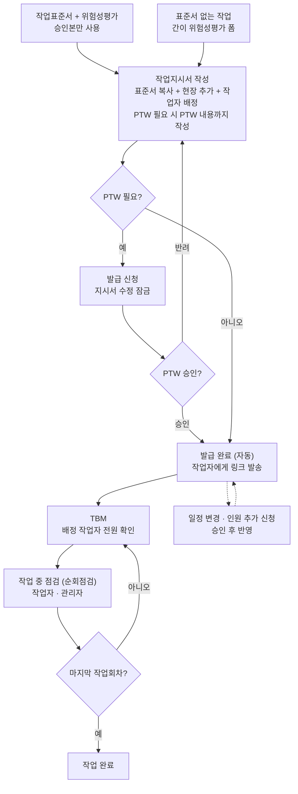
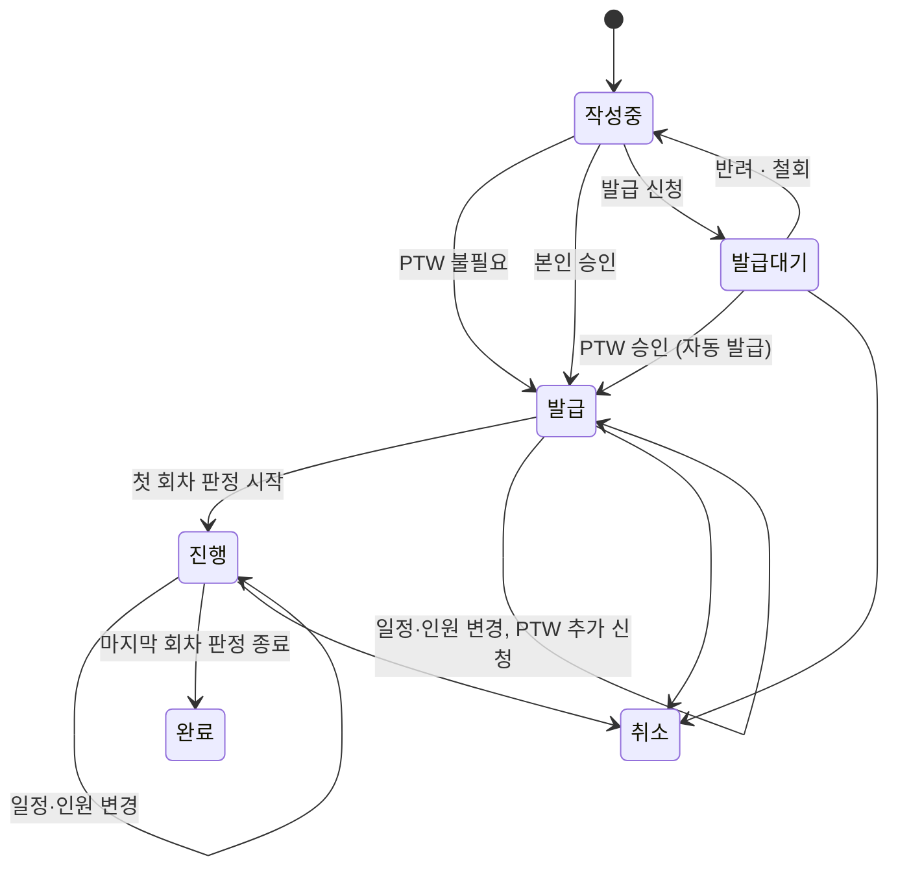
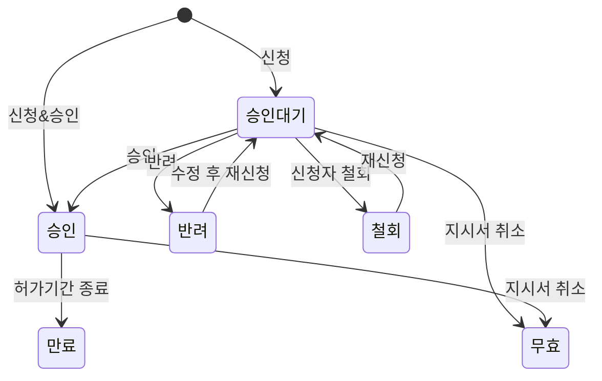

# SMBE 설계 정리 v5.4

작성 기준일: 2026-09-18
구분: **확정** = 결정한 내용 / **확인 필요** = 가정으로 넣었거나 외부 확인이 필요한 내용 / **미정** = 아직 논의 안 한 내용

v5.10 변경: **허용 여부는 수준에서 자동** — 위험요인의 허용 가능 여부를 사람이 고르지 않고 위험성 수준 + 회사 판단 기준에서 정한다(손으로 못 바꾼다). 조치 후 허용 여부도 같은 규칙 (2026-09-24)
v5.9 변경: **표준서 개정본(판) 확정** — 승인된 판은 고치지 않는다. 개정은 현재 판을 통째로 복사한 초안을 고쳐 승인(자기 승인)하고, 지시서·위험성평가는 그때의 판을 기록한다. 승인 대기·반려 상태와 `STD-0012-V2` 식 버전 ID 는 두지 않는다 (2026-09-24)
v5.8 변경: 지시서 출력물을 **유료 기능으로 전환** (v2.6 의 "출력물은 무료 허용" 을 뒤집는다). 출력물은 작업 정보·위험요인·체크리스트·QR 을 담은 **현장 게시용 A4 한 장**이며, 무료는 버튼을 눌렀을 때 안내로 막는다
v5.7 변경: 회차 입력 게이트를 작업일자(KST) 하나로 단순화 (미래 회차만 잠금, 오늘·지난 회차는 이어 입력 허용). 상태는 FUTURE/TODAY/PAST + done 불리언
v5.6 변경: 작업자 진입을 QR(로그인)과 배정별 토큰 링크(무로그인) 두 경로로 확정, TBM 증빙을 경로별로 구분, 위험성 수준 판단 기준을 회사 설정으로 이관(평가는 생성 시 사본 보관), 화면 문구의 "Pro"를 "유료"로 통일 (Pro는 인원 구간명)
v5.5 변경: 요금제를 인원 구간별 정액제로 전환 (Basic ~19인 / Standard ~49인 / Pro ~99인, 100인 이상 개별 협의). 세 구간의 기능은 동일하며 기능은 무료/유료로만 갈린다
v5.4 변경: 법률 가이드 인원규모를 4개 구간(5인 미만 / 5~19인 / 20~49인 / 50인 이상)으로 분기, 회사 생성 시 초기 인원규모 저장 및 실제 활성 인원과 구분
v5.3 변경: 비로그인 안전법 가이드·위험성평가 인정 준비도 진단 추가, 결과 확인 후 가입·작성 연결, 메인 슬로건 반영, 설계·레이아웃 버전 5.3 통일
v5.2 변경: 최초·정기평가 안내 기준 수정 및 기존 종이 평가 이관 제외, 간이평가 데이터 구조·필수 기록 보완, 지시서 상세 상태 분리 표시 및 기간 종료 후 미조치 유지
v5.1 변경: 간이 위험성평가에 업종별 기본 템플릿 자동 적용 (템플릿 콘텐츠는 추후 제작)
v5.0 변경: 주간 안전점검 회의 추가, 상시평가 요건 매핑 정리
v4.9 변경: 최초 위험성평가 안내를 할 일 카드 형태로 변경 (문구 대신 단계·시작 버튼)
v4.8 변경: 법정 누락 항목 보완 (사전조사 안전보건정보, 위험성 수준 판단 기준, 실시규정, 최초평가 기한 안내)
v4.7 변경: 사업장 위험성평가 현황 화면 추가 (회차 기간 기준 자동 수집, 미평가 작업 표시)
v4.6 변경: 안전점수는 무료티어에도 전부 제공
v4.5 변경: 안전점수(위험성평가 인정 기준 기반) 메인 화면 기능 추가
v4.4 변경: 사업장 단위 위험성평가 현황을 확장 메뉴로 기록
v4.3 변경: 표준서→위험성평가 연속 작성 UX, 표준서 상세에 평가 표시, 템플릿 세트화, 1년 경과 경고·메일 알림
v4.2 변경: 표준서 버전 ID 규칙(V1, V2…), 표준서 신규·개정 시 위험성평가 연계 안내
v4.1 변경: 작업표준서와 위험성평가 분리 (위험성평가가 표준서 ID 연계, 법정 기록 항목 반영)
v4.0 변경: 인원 돌려막기 대응 안 하기로 확정
v3.9 변경: 인원 카운트를 일자 겹침 기준으로 확정, 과금 내역 조회 화면 추가
v3.8 변경: 한도 초과 시 회사 전체 Pro 전환·전체 인원 과금(A안)으로 확정
v3.7 변경: 일일 사용량 기반 청구 로직 추가
v3.6 변경: 소속 기간 이력 설계 추가 (일할 청구 근거, 청구 스냅샷)
v3.5 변경: 과금 방식 구체화 (일할 계산 기준, 결제 수단, 결제 실패 처리)
v3.4 변경: 운영자 백오피스 추가 (회사별 무료 인원 한도 설정, 기본 10명)
v3.3 변경: 업종별 공통 표준서·체크리스트 템플릿(회사 생성 시 업종 입력), 작업장소 직접입력 선택지
v3.2 변경: 온보딩·첫 사용 흐름 추가 (사전 준비 없이 초대 → 작업지시 한 사이클)
v3.1 변경: 향후 확장 메뉴 정리 (15장, 미설계)
v3.0 변경: 안전사고 등록 기능 추가 (지시서 연계 / 별도 사고)
v2.9 변경: Pro티어 모바일 업무 기능 추가 (무료티어 모바일은 지시서 확인·TBM·점검만)
v2.8 변경: 자가 승인 건 태그 표시 (출력물·감사 로그·목록)
v2.7 변경: 무료티어 열람 제한 대상을 작업지시 내역·점검 기록으로 한정, 기간 1개월 → 1주일
v2.6 변경: 무료티어 데이터 삭제 → 1개월 이전 기록 열람 제한, 지시서 출력물은 무료 허용
v2.5 변경: 요금체계 개편 (무료티어 / Pro티어, 100인 이상 별도 협의)
v2.4 변경: 전자서명을 체크 후 저장 방식으로 단순화
v2.3 변경: 작업 전 점검 → TBM으로 명칭 변경(체크리스트 + 작업자 전자서명), PTW 미승인 표시를 작업자 화면에도 노출, 이전 회차 불량 조치 내용 팝업
v2.2 변경: 작업 장소 중간 단계 선택 허용
v2.1 변경: 회사정보 관리 메뉴 추가 (인원관리, 장소관리 5단계)
v2.0 변경: 자격 확인·배정 차단 삭제, 작업 없음 처리, 승인 기한(당일까지), 자동발급 필수값 검증, 무료 종료 후 처리, 감사 로그, 회사 탈퇴 시 삭제 규칙 추가
v1.9 변경: 인원 추가 승인 대기 중에도 해당 작업자 작업·점검 가능
v1.8 변경: 브랜드 정보 추가 (SMBE)
v1.7 변경: 발급대기 상태 도입(수정 잠금, PTW 승인 시 자동 발급), 발급 후 일정·인원 변경 규칙 추가
v1.6 변경: 복사본 원본 지시서 ID 연결 삭제
v1.5 변경: PTW 항목 확정 (작업장소 마스터, 화기작업·화재감시자, 비상연락처 다건), 과금 후불제·일할 계산 확정
v1.4 변경: 관리자도 작업 전 점검 가능, 작업 중 점검 = 순회점검으로 작업자·관리자 누구나 가능
v1.3 변경: 역할 변경 규칙 추가 (관리감독자 → 안전관리자 본인 변경 가능, 안전관리자 → 관리감독자 승격은 관리감독자만)
v1.2 변경: 관리감독자·안전관리자 권한 완전 동일화 (관리자 그룹 단위 권한), PTW 승인자·초대·가입 승인도 관리자 전체
v1.1 변경: 회사 생성자 관리감독자 권한, 가입 경로별 승인(초대 링크는 승인 없음, 직접 가입은 관리감독자 승인)
v1.0 변경: 회사코드 변경 삭제, 본인 퇴사 처리 후 다른 회사 가입 방식으로 변경
v0.9 변경: 상태값 확인 필요 항목 확정 (초안 → 확정)
v0.8 변경: 작업 전 점검 여부와 무관하게 작업 중 점검 가능 (순서 강제 삭제)
v0.7 변경: 작업 중 점검 수행자를 관리감독자·안전관리자로 확정
v0.6 변경: 작업 후 점검 → 작업 중 점검으로 변경 (표준서 체크리스트 작업 전 / 작업 중)
v0.5 변경: 작업 전 점검 전원 필수, PTW 신청 철회, 발급 후 PTW 추가 신청, 조치 내용 필수 반영
v0.4 변경: 상태값 초안 추가 (12장)
v0.3 변경: 지시서 승인 개념 삭제(작성자가 바로 발급), PTW 승인 후 지시서 발급으로 흐름 수정, PTW 신청자·불량 처리 확정, 표준서 개정본 승인 확정

---

## 0. 브랜드

- 공식 표기: **SMBE**
- 발음: 에스엠비
- 철학: **Safety Must Be Easy**
- 슬로건: **Safety must be easy.**
- 관리자 홈 상단: 위 슬로건을 제목으로 표시하고 **easy.**를 주황색으로 강조
- 홈 보조 문구: 안전관리, 쉽고 간편하게 시작하세요.
- 한국어 메시지: 안전은 쉬워야 합니다.

---

## 1. 서비스 개요

### 확정
- 중소기업용 포털형 안전관리 시스템
- 별도 문의·협의 없이 **가입 후 로그인하면 바로 사용**
- **무료는 인원 제한 없이 평생 사용 가능** (기능이 제한되지 유료 전환이 강제되지 않는다)
- 유료 요금의 인원 기준: **현재 활성 인원** (관리자 포함)
- 작업자에게 작업지시가 내려가는 단계까지 포함
- 올인원 구성: **작업표준서 · 위험성평가 → PTW → 작업배원 및 지시 → QR 안전점검**
- 첫 개발 범위: 위 기능 전체 및 아래 비로그인 공개 가이드·자가진단

### 비로그인 공개 유입 화면 (v5.4 확정)

**목적:** 검색·공유로 방문 → 우리 회사에 필요한 안전관리 확인 → 부족한 준비 확인 → 가입 후 SMBE에서 실제 기록 작성으로 연결한다. 상담·무료체험 신청 없이 바로 결과를 확인하는 경험을 가입 전부터 제공한다.

| 공개 기능 | 내용 | 로그인 필요 여부 |
|---|---|---|
| 우리 회사 안전법 가이드 | 중대재해처벌법·산업안전보건법의 적용사항, 해야 할 일, 필요한 기록, 공식 근거 | 열람·조건 선택 모두 불필요 |
| 위험성평가 인정 준비도 진단 | 신청대상 검토 → 준비상태 질문 → 부족한 항목·다음 행동 | 질문·결과 전체 불필요 |
| 실제 평가·작업지시 작성 | 진단에서 선택한 다음 행동을 회사 업무로 이어가기 | 로그인 및 회사 연결 필요 |

**공개 범위와 유료 정책**
- PC·모바일 모두 공개 페이지를 제공한다. 무료 모바일의 회사 관리 업무 제한과는 별개다.
- 진단 결과 확인에 가입·연락처 입력을 요구하지 않는다.
- 사진, 모바일 관리, 과거 작업·점검 기록 열람 등 기존 Pro 정책은 그대로 유지한다.
- 공개 기능은 회사 데이터 조회가 아니라 안내·자가응답 기반 진단이다. 기존 업무 화면과 API의 인증·회사 권한 검사는 유지한다.

**우리 회사 안전법 가이드**
- 중대재해처벌법 / 산업안전보건법을 구분하고, **법률상 주요 의무가 달라지는 인원 구간**에 따라 안내한다. 하나의 인원 기준을 모든 의무에 일괄 적용하지 않는다.
- 기본 인원 구간은 **5인 미만 / 5인 이상~20인 미만 / 20인 이상~50인 미만 / 50인 이상**으로 고정한다.
- 화면 구간은 이해를 위한 분류이고, 실제 적용 여부는 사업 종류·상시근로자 산정·시행일 등 개별 조건을 함께 확인해 안내한다. 구간만으로 법적 의무를 자동 확정하지 않는다.
- 가이드 첫 단계에서 사용자가 구간을 선택하거나 회사 생성 시 저장된 규모를 불러온다. 사용자가 직접 수정할 수 있다.
- 설명 순서: 누구에게 적용되는가 → 무엇을 해야 하는가 → 어떤 기록을 남기는가 → 지금 시작할 일.
- 첫 화면에서 법률 전문을 길게 보여주기보다 질문별 요약과 상세 펼치기를 제공한다.
- 적용 기준일, 마지막 검토일, 공식 출처 링크를 표시한다. 현재 시행 내용과 시행 예정 내용을 구분한다.
- '최신' 표시는 실제 검토한 기준으로 관리한다. 문서 버전 5.4 자체가 법령 최신성 검증을 뜻하지 않는다.
- 관련 질문별 개별 주소를 제공하고, 각 페이지에서 인정 준비도 진단과 관련 SMBE 작성 기능으로 연결한다.

**위험성평가 인정 준비도 진단**
- 명칭은 **위험성평가 인정 준비도 진단**. 공식 인정 확정이나 합격 예측 점수로 표현하지 않는다.
- 1단계: 업종·규모 등 해당 인정제도의 신청대상 판단에 필요한 조건을 질문한다.
- 2단계: 위험요인 확인, 근로자 참여, 감소대책·이행, 기록 관리 등 준비상태를 질문한다. 최종 문항과 판정 기준은 공개 전 공식 최신 기준과 대조한다.
- 답변은 예 / 아니오 / 모르겠음을 기본으로 하고, 필요한 경우 조건별 추가 질문을 노출한다.
- 종이·엑셀 등 외부에서 수행한 평가·기록도 준비상태 답변으로 인정한다. SMBE 사용 여부나 과거 문서 이관을 진단 조건으로 두지 않는다.
- 결과는 **신청대상 검토**와 **준비상태**를 분리한다. 대상 조건에 맞더라도 준비상태나 실제 인정 여부를 자동 확정하지 않는다.
- 항목별 **충족 / 보완 필요 / 확인 필요**를 제시하되, 충족은 '사용자 응답 기준'임을 표시한다.
- 결과에는 부족한 항목과 다음 행동을 보여주고, 하단에 '자가응답 기반 사전 점검이며 실제 인정은 안전보건공단의 별도 심사를 거칩니다'를 짧게 표시한다.
- 안전점수의 최종 산식·배점은 추후 조정한다. 공개 진단에 미확정 점수·인정 기준선을 그대로 적용하지 않는다.

**가입 전환 및 이어가기**
- 안내 CTA: **우리 회사 안전관리 시작하기**.
- 진단 결과 CTA: **부족한 항목 무료로 준비하기**. 평가가 필요한 경우 **무료로 평가 작성 시작하기**처럼 구체화한다.
- 구현된 SMBE 기능으로 해결 가능한 항목은 해당 작성 화면으로 연결한다. 교육 등 현재 미구현 기능은 준비 방법·공식 안내로 연결하고 자동 해결을 약속하지 않는다.
- 업종·인원규모 구간·답변·선택 행동을 브라우저 세션에 임시 유지하고 로그인·회사 연결 후 이어간다. 민감한 답변을 주소 쿼리로 전달하지 않는다.
- 업종·인원규모 구간 등 회사 기본값은 확인 후 반영한다. 자가진단의 인원 답변으로 회원 등록·과금 인원을 생성하거나 변경하지 않는다.
- 자가응답을 실제 위험성평가 완료·조치완료·승인 기록으로 자동 변환하지 않는다.
- 기존 회원은 소속과 권한을 확인하고 목표 화면으로 연결한다. 직접 회사 가입 승인대기 상태라면 다음 행동을 보존하고 승인 후 이어간다.

**검색 유입·운영**
- 공개 가이드 본문은 SSR 또는 정적 사전 렌더링으로 제공하고, 문서별 제목·설명·고유 URL·사이트맵을 구성한다.
- 검색에 노출할 대상은 가이드·진단 소개다. 개인 진단 결과·응답은 검색 노출과 공개 공유 대상에서 제외한다.
- 운영자는 법령 안내와 진단 규칙에 공식 출처·적용일·검토일·버전을 관리한다. 초기에는 파일 기반 콘텐츠로 운영 가능하며 별도 대형 CMS는 필수가 아니다.
- 현재 기준을 확인하지 못한 항목은 '확인 필요'로 표시하고 공식 확인 경로를 제공한다. 혜택·신청대상 수치를 미검증 상태로 확정 표시하지 않는다.
- 유입 → 진단 시작 → 완료 → 가입 → 첫 평가 저장의 전환을 측정한다. 분석 이벤트에 답변 원문·개인정보는 넣지 않는다.
- 공개 페이지 개발과 별개로 최신 법령 해설 원문, 최종 진단 문항·규칙, 인정 혜택의 구체 수치는 출시 전 확인할 콘텐츠 작업이다.

### 온보딩 · 첫 사용 흐름 (확정)

안전시스템이 익숙하지 않은 사용자를 전제로 한다. **사전 준비 없이 인원 등록 → 작업지시까지 바로 가능**해야 하고, 필요를 느낄 때 하나씩 추가하는 구조로 간다.

- 가입 후 홈 화면에 버튼 두 개
  - **회사 작업자 / 관리자 초대하기** → 초대 링크 발송
  - **오늘의 작업 지시하기** → 작업지시서 작성으로 연결
- 표준서가 없어도 **간이 위험성평가 + PTW 여부 체크**만으로 지시서 발급 가능 → 첫 사이클(지시 → TBM → 작업 중 점검 → 완료)을 그대로 경험
- 지시서에서 **표준서를 넣으려는데 없으면 표준서 등록 화면으로 이동**, 등록 후 작성 중이던 지시서로 복귀
- 장소·표준서·체크리스트 템플릿은 미리 세팅하지 않아도 되고, 필요해질 때 각 관리 화면에서 추가

**첫 사이클 마찰 제거 (확정)**
- **업종별 공통 템플릿 제공**
  - 회사 생성 시 **업종을 입력**받고, 해당 업종의 **기본 표준서 · 체크리스트 템플릿**을 제공
  - 표준서 작성과 간이 위험성평가 양쪽에서 **템플릿 불러오기**로 사용, 불러온 뒤 수정 가능
- **작업 장소에 "직접입력" 선택지 상시 제공**
  - 장소 마스터가 비어 있어도 직접입력으로 진행 가능
  - 같은 화면에서 **장소관리 세팅 화면으로 이동하는 경로** 제공
  - 직접입력 값은 해당 건에만 저장 (마스터 자동 등록 없음)

---

### 요금제 (확정)

무료는 **인원 제한 없이** 유지하고, 유료는 **현재 재직 인원 구간별 월 정액**이다.
세 구간의 기능은 모두 같다 — 기능은 무료/유료로만 갈리고, 구간은 가격만 가른다.

| | 무료 | 유료 |
|---|---|---|
| 대상 | 인원 제한 없음, **평생 무료** | 아래 부가 기능이 필요할 때 자발적 전환 |
| 텍스트 기반 기능 (표준서, 지시서, PTW, TBM, 점검) | O | O |
| 알림 | 메일 + QR(대면 배포) | 메일 + **알림톡**(실패 시 SMS 대체발송) |
| 사진 첨부 (표준서 작성 · 점검 · 사고) | X | O |
| 점검 모니터링 · 대시보드 | X | O |
| 지시서 출력물 (A4 한 장 · QR 포함) | **X** (버튼 클릭 시 안내) | O |
| 점검 결과 보고서 출력 | X | O |
| 모바일 업무 기능 (표준서 열람, 지시서·PTW 생성, 점검 기록 열람 등) | X | O |
| 모바일 현장 기능 (지시서 확인, TBM, 점검) | O | O |
| 지난 기록 열람 (작업지시 내역 · 점검 기록) | **최근 1주일 이내만** (이전은 건수만 표시) | 전체 |
| 표준서 · 진행 중 지시서 · PTW 열람 | O | O |
| 데이터 보관 | 물리 삭제 없음, 보관 기간까지 유지 | 보관 기간까지 유지 |

**인원 구간** (기준 인원 = 현재 재직 인원, **관리자 포함**)

| 구간 | 인원 | 정가 (VAT 포함) | 출시 할인가 (VAT 포함) |
|---|---|---|---|
| Basic | ~19인 | 55,000원 | 33,000원 |
| Standard | ~49인 | 132,000원 | 88,000원 |
| Pro | ~99인 | 242,000원 | 165,000원 |
| 개별 협의 | **100인 이상** | 문의 | 문의 |

- **Basic · Standard · Pro 는 인원 구간의 이름이지 기능 등급이 아니다.** 그래서 화면의
  기능 안내에는 구간 이름을 쓰지 않고 **"유료"** 라고 쓴다. "Pro 요금제에서 사진을 첨부할
  수 있습니다" 라고 쓰면 Basic 고객이 자기는 못 쓰는 기능으로 읽는다. 구간 이름은 요금제
  화면에서만 쓴다
- 금액은 **공급가(VAT 별도)** 로 저장하고 화면에서만 VAT 포함가로 환산한다 (세금계산서에
  공급가·부가세가 분리돼야 하기 때문)
- **정가를 먼저 박고 할인으로 출시**해, 나중에 할인 폭을 줄이는 방식으로 자연스럽게
  인상한다. 가입 시점 가격은 **12개월 보장**
- 할인율은 구간마다 다르므로(40% / 33% / 32%) 화면에는 구간별 실제 할인율을 계산해
  표시하고 배지는 "최대 40%" 로 둔다. 상수로 박으면 가격을 고칠 때 문구가 어긋난다
- 구간·가격·상한·정산 계산의 정의는 `src/features/billing/plans.ts` 한 곳에 있다

**구간 변경 (확정)**

- **상향**: 남은 기간의 현재 요금을 크레딧으로 차감한 금액을 즉시 결제하고 **그날이 새
  결제 기준일**이 된다. 다음 주기부터 새 구간 요금을 온전히 청구한다
- **하향**: **다음 결제 주기부터** 적용, 중도 환불 없음
- **계약 인원을 다 쓰면 인원 등록을 막는다.** 등록이 결제의 트리거다. 차단 지점은 인원이
  실제로 늘어나는 두 곳뿐 — **초대 수락**과 **가입 승인**. 회사코드 가입 신청 자체는 막지
  않는다(신청은 대기열에 남고 관리자가 승인할 때 걸린다)
- **무료 회사에는 아무 이벤트도 없다.** 무료는 인원이 아니라 기능이 제한되므로 20인째든
  200인째든 그대로 등록된다
- 계약 구간(`companies.plan`)은 실제 인원과 **분리해 저장**한다. 인원에서 구간을 계산하면
  인원이 늘 때 구간도 따라 올라가 초과 판정 자체가 성립하지 않는다
- 기준 인원은 `companies.active_headcount` 를 쓴다. 법적 개념인 `employee_size_band`
  (중대재해처벌법 판단용)와는 경계가 비슷해도 **분리**한다 — 법이 바뀔 때 요금까지
  흔들리면 안 된다

### 결제 (확정)
- **카드 자동결제(빌링키)가 기본**
- **세금계산서 발행 후 계좌이체**도 지원하되, 수금 리스크를 줄이기 위해 **연간 선납 조건**에 한함
- 결제 성공 시 **세금계산서 자동 발행**
- 결제 실패 시: 재시도 후에도 실패하면 **무료로 자동 강등** (데이터는 유지, 열람만 제한)
- **100인 이상은 별도 문의(CONTACT)로 가격 협의**
- **미구현**: 결제(PG)는 아직 없다. 구간 판정 · 등록 차단 · 가격 표시 · 상향 정산 계산까지
  구현돼 있고, `plan` 을 바꾸는 주체는 현재 운영자 백오피스뿐이다. 과금 내역 조회 화면과
  얼리버드 보호 만료일을 회사별로 저장하는 구독 테이블은 결제 도입 시 함께 만든다

### 운영자 백오피스 (확정)

서비스 운영자(SMBE) 전용 화면. 회사 내 "관리자(관리감독자 · 안전관리자)"와는 별개 권한.

- 회사 목록 조회 (업종, 인원, 요금제, 가입일)
- **회사별 요금 구간 변경** (결제 도입 전까지는 입금 확인 후 여기서 반영한다.
  구간을 올리면 등록이 다시 열리고 결제 기준일이 갱신된다)
- 요금제 상태 · 청구 내역 확인
- 100인 이상 개별 요금 조건 설정
- 무료 모바일은 **현장 기능(지시서 확인 · TBM · 점검)만** 제공. 표준서 열람, 지시서 · PTW 생성, 점검 기록 열람 등 관리 업무는 PC에서만 가능

---

## 2. 전체 프로세스 흐름

- 지시서 자체에는 승인 절차 없음. PTW 필요 건만 PTW 승인이 발급 조건
- PTW 필요 건: 발급 신청 → **발급대기(수정 잠금)** → PTW 승인되면 **자동으로 발급 완료**
- PTW 불필요 건: 신청 없이 바로 발급 완료
- PTW는 종료 단계 없음. 허가 기간이 끝나면 만료

---

## 3. 역할 · 권한 요약

역할 코드는 회사별로 **관리감독자, 안전관리자, 작업자** 3개.
**관리감독자와 안전관리자의 권한은 역할 변경을 제외하고 완전히 동일**하며, 권한 검사는 두 역할을 묶은 **관리자 그룹** 단위로만 한다. (구현 시 역할 이름이 아닌 `isManager()` 같은 그룹 판정으로 처리 → 추후 분리 시 한 곳만 수정)

| 기능 | 작업자 | 관리자 (관리감독자 · 안전관리자) |
|---|---|---|
| 표준서 작성 | O | O |
| 표준서 확정(판 확정) | X | O |
| 표준서 개정 | O | O |
| 표준서 폐기 | 작성자만 | O |
| 작업지시서 작성 · 발급 | X | O |
| PTW 신청 (지시서 작성 중) | X | O |
| PTW 승인 | X | 지정된 1명 |
| TBM (작업 전) | 배정된 지시서 (전원 필수) | O |
| 작업 중 점검 (순회점검) | 배정된 지시서 | O |
| 점검 누락 웹 추가입력 · 수정 | X | O |
| 불량 알림 수신 · 조치완료 처리 | X | 선택된 1명 |
| 회사 인원 초대 링크 발송 | X | O |
| 회사코드 직접 가입 승인 | X | O |
| 회원 관리 (역할 부여, 퇴사 처리) | X | O |
| 관리감독자로 승격 | X | 관리감독자만 |
| 본인을 안전관리자로 변경 | X | 관리감독자 본인 |
| 본인 퇴사 처리 | O | O |

---

## 4. 회원 · 회사

### 확정
- 로그인: **네이버, 구글, 카카오**
- 휴대폰 번호 인증은 두지 않음
- **회사를 처음 만든 사람은 관리감독자 권한** (추후 변경 가능), 회사 생성 시 회사코드 발급
- 회사 생성 시 회사명·업종과 함께 **초기 인원규모 구간(5인 미만 / 5~19인 / 20~49인 / 50인 이상)**을 받는다.
- 회사 생성 시 **업종 입력** → 업종별 기본 표준서 · 체크리스트 템플릿 제공에 사용
- 회사 생성 시 **초기 인원규모 구간** 입력: `UNDER_5`, `FROM_5_TO_19`, `FROM_20_TO_49`, `FROM_50` 중 하나를 선택
- 초기 인원규모 구간은 법률 가이드 개인화와 회사 프로필 표시용이다. 실제 요금·권한·법령 적용 판정의 근거는 등록된 활성 인원과 관련 법령 조건을 별도로 사용한다.
- 인원 등록·퇴사로 활성 인원이 구간을 넘으면 실제 인원 구간을 자동 갱신하고 관리자에게 안내한다. 초기 구간의 변경 이력은 감사 로그에 남긴다.
- 소속이 있어야 회사 업무 가능. 공개 안전법 가이드·인정 준비도 진단과 결과 확인은 로그인·회사 소속 없이 이용 가능
- 회사 가입 경로 2가지
  - **초대 링크**: 관리감독자가 예비 가입자에게 링크 발송 → 링크로 가입하면 **승인 없이 바로 소속**
  - **직접 가입**: 포털에서 가입 후 **회사코드 입력** → **관리감독자 승인 후 소속**
- **1인 1회사**, **회사코드 변경 기능 없음**
- 다른 회사로 옮기려면 **본인이 퇴사 처리** → 소속 없음 → 새 회사코드 입력
- 퇴사 시 **과거 기록(점검, TBM 확인 등)은 이전 회사에 보존**
- 퇴사 시 배정된 작업이 남아 있으면 **자동 배정해제 + 알림**
- 회사에 관리자가 1명뿐이면 그 사람의 **퇴사 차단**
- **역할 변경 규칙**
  - 관리감독자는 **본인 의사로 안전관리자로 변경 가능**
  - 안전관리자는 스스로 올라갈 수 없고, **다른 관리감독자가 관리감독자로 승격**시켜야 함
  - 회사에 관리감독자가 1명뿐이면 그 사람의 **역할 변경·퇴사 차단** (승격시켜줄 사람이 없어짐)
- 퇴사자는 선택 목록(콤보박스 등)에서 제외

### 소속 기간 이력 (확정)

일할 청구의 근거이자 과거 기록의 소속 판정 기준.

**구조: 소속 기간 테이블 1개**

`company_member` = user_id, company_id, role, joined_at, left_at(NULL이면 현재 소속), status

- 가입·승인 시 행 1건 생성 (`joined_at` 기록, `left_at` = NULL)
- 퇴사 시 같은 행의 `left_at`만 기록 (행 삭제 없음)
- 재입사·타 회사 가입은 **새 행** 추가 → 1인 1회사는 "left_at이 NULL인 행이 1개"로 보장
- **역할 변경은 새 행을 만들지 않고** 같은 행의 role만 갱신, 변경 이력은 감사 로그에 남김
- 인덱스: (company_id, left_at), (user_id, left_at)

**일할 청구 계산**
- 해당 월과 소속 기간이 겹치는 일수를 인원별로 합산
  - 조건: `joined_at <= 월말` AND (`left_at` IS NULL OR `left_at >= 월초`)
- 인원별 금액 = 월 요금 × (겹친 일수 ÷ 그 달의 일수)
- 월 마감 시 **청구 스냅샷**(회사, 연월, 인원별 일수·금액, 합계)을 별도 저장 → 이후 소속 데이터가 바뀌어도 과거 청구서는 불변

**과거 기록 소속 판정**
- 점검·지시서 등 기록에는 작성 시점의 company_id를 함께 저장 (이미 확정)
- 소속 기간 이력은 "그 시점에 이 사람이 어느 회사 소속이었는지"를 되짚는 용도로만 사용

---

### 회사정보 관리 메뉴 (확정)

관리자만 접근. 두 개 하위 메뉴로 구성.

**인원관리**
- 인원 리스트 조회
- **초대 링크 발송** (전화번호 또는 이메일 입력 후 전달)
- 인원정보 수정
  - 전화번호, 이메일
  - **자격증**: 자격증 이름 + 첨부파일 (참고 정보, 배정 제약 없음)
  - 권한: 관리감독자 / 안전관리자 / 작업자
- 퇴사 처리

**장소관리**
- 작업 장소를 **최대 5단계 계층**으로 등록 (예: 사업장 > 동 > 층 > 구역 > 설비 위치)
- 등록한 장소는 PTW 작업 장소 콤보박스에서 선택
- **말단 단계뿐 아니라 중간 단계도 선택 가능** (3단계만 쓰는 회사도 그대로 사용)

---

## 5. 작업표준서 · 위험성평가

작업표준서와 위험성평가는 **별개 문서**다. 표준서는 작업을 어떻게 하는지에 대한 표준이고, 위험성평가는 그 작업의 유해·위험요인과 대책을 다루는 법정 문서다. 위험성평가는 **작업표준서 ID를 연계**해서 작성하며, 표준서 없는 작업의 간이평가는 표준서 연결 없이 같은 평가 데이터 구조를 사용한다.

### 5-1. 작업표준서 (확정, v5.9 개정본 구조)
- 표준서가 **마스터**, 작업지시서는 표준서를 기반으로 만든 실제 작업 건
- **작성·개정·확정·폐기는 관리자**(관리감독자·안전관리자, 권한은 동일). 작업자 작성과 별도 승인 대기는 두지 않는다. 작성하면 곧 **1판**으로 확정된다(자기 확정, 감사 로그에 남는다)
- 화면 용어는 **"확정"** 으로 통일한다 (2026-09-24 사장님 결정). "승인" 은 위험성평가·PTW 처럼 승인자·승인일이 법정 기록인 문서에만 쓴다. DB 상태값 `APPROVED` 는 그대로
- **확정된 판은 고치지 않는다.** 고치려면 **표준서 개정**(확인 창: "개정본은 기존 표준서를 복사하여 만들어지며, 수정하여 확정하면 됩니다") → 현재 판을 통째로 복사한 **초안(다음 판 번호)** → 고친 뒤 확정. 초안은 표준서당 하나. 확정 전까지는 기존 판을 그대로 사용하고, 초안은 버릴 수 있다. **초안이 있는 동안은 폐기할 수 없다** — 먼저 버리거나 확정하라고 안내한다
- 복사 범위: 작업명, PTW 필요 여부, 작업 단계, 체크리스트, **단계 사진**(같은 파일을 새 단계가 가리킨다). 사진을 붙이거나 지우는 것도 **초안에서만** — 승인된 판은 사진까지 그대로 남는다
- 확정 시 **개정 사유** 한 줄(선택). 상세의 개정 이력에 판·확정일·확정자·사유가 남고, **지난 판은 그대로 읽힌다**
- 표준서 내용: 작업명, 작업 단계·방법, **PTW 필요 여부 체크(Y/N)**
- 표시는 **"n판"** (`STD-0012-V2` 식 버전 ID 없음). 표준서의 이름·PTW 는 현재 판의 거울
- 지시서·위험성평가는 **판 단위**로 연결: 지시서는 **표준서를 고르는 순간 그 판이 지시서에 붙는다**(초안 상세에도 "이름 (n판)" 으로 보이고, 지난 판이면 그 판 화면으로 링크). 발급 사본에도 판 번호가 남고, 지시서에서 요청한 평가도 같은 판을 적는다. 평가 회차는 만들 때의 현재 판. 그래서 표준서가 나중에 개정돼도 "그날 그 표준서" 로 돌아간다
- 회사 단위 PTW ON/OFF 설정 없음
- **체크리스트 필수** (PTW 여부 무관), **TBM(작업 전) / 작업 중**으로 구분
- PTW 전용 사전 체크리스트 없음
- **체크리스트 템플릿 불러오기** 제공
- **업종별 기본 표준서 · 체크리스트 템플릿** 제공 (회사 업종 기준, 모든 회사 공통 제공)

### 5-2. 위험성평가 (확정)

**구조**
- 일반 평가와 간이평가는 **같은 데이터 구조**를 사용하며, 작업표준서 연결은 선택값이다. 표준서 기반 평가는 표준서와 **그때의 판**을 함께 연결하고, 간이평가는 연결 없이 작성
- **표준서 1건 : 위험성평가 N건** (최초 1건 + 이후 수시·정기 회차가 누적). 회차마다 어느 판이었는지 남는다
- 표준서와 별도로 승인 관리, 승인된 평가만 지시서에 사용
- 지시서 작성 시 표준서 정보와 **연계된 최신 승인 위험성평가**를 함께 스냅샷 복사

**표준서와 연계된 실시 흐름**
- **표준서 신규 작성 → 마지막 단계에서 최초 위험성평가를 이어서 작성** (별도 메뉴로 나가지 않고 한 흐름으로 진행). 평가 없이는 해당 표준서로 지시서 발급 불가
- **표준서 개정(2판, 3판…)** 뒤 위험성평가는 상세의 "위험성평가 다시하기" 로 실시한다 (v5.9 구현: 개정 승인이 평가 작성으로 자동 이어지지는 않는다)
- 그 외 사유로 **수시 평가를 언제든 추가** 가능
- 실시 구분은 작성 시 선택 (최초 / 정기 / 수시 / 상시)

**회사 단위 설정 (확정)**
- **위험성 수준 판단 기준**: 기본값 **상 / 중 / 하** 제공, 회사가 기준 문구와 **허용 가능한 위험성 수준**(허용 가능 / 감소대책 후 허용 / 허용 불가)을 수정 가능
  - 기준을 정하거나 변경할 때 근로자 참여 기록
  - **허용 여부는 이 기준에서 자동으로 정해진다** (v5.10). 위험요인에 수준을 고르면 "중 → 감소대책 후 허용 · 조치 필요" 처럼 판정이 붙고 사람이 바꿀 수 없다. 처음 평가는 "허용 가능" 만 허용, 나머지 둘은 조치 필요(감소대책·담당·예정일). 조치 후에는 감소대책을 실행했으니 "감소대책 후 허용" 도 허용이고 "허용 불가" 만 추가 대책이 필요하다. 서버가 평가에 복사된 기준 사본으로 다시 계산해 저장하므로 화면 값은 믿지 않는다. 예외가 필요하면 항목을 바꾸는 게 아니라 회사 기준을 고친다
- **위험성평가 실시규정**: 공단 표준 예시 기반 **템플릿 제공 + 편집 화면**
  - 내용: 목적·방법, 담당자 역할과 책임, 실시 시기 등
  - 위험성평가 인정 심사 항목이기도 함

**최초평가 안내 · 기존 자료 처리 (확정)**
- 최초평가 안내 기준: **해당 사업장에서 최초로 작업을 시작하기 전까지 실시** (산업안전보건법 시행규칙 제37조)
- 기존의 사업 개시 후 1개월 착수 안내 및 해당 D-day 표시는 사용하지 않음
- **기존 종이·외부 평가 자료는 업체가 자체 보관**. SMBE로의 등록·이관·재입력을 요구하지 않으며 별도 이관 기능도 두지 않음
- SMBE에서는 **앞으로 실시하는 평가부터 관리**. 시스템에 기록이 없다는 이유만으로 실제 미실시라고 판정하지 않음
- 안내는 **할 일 카드**로 제공 (온보딩 버튼과 같은 자리에 배치)
  - 신규 작업 안내: "최초 작업 시작 전에 위험성평가를 실시하세요"
  - 기존 사업장 안내: "앞으로 실시하는 위험성평가를 SMBE에서 관리하세요. 아직 평가하지 않은 작업은 평가를 진행하세요"
  - 표준서 기반: ① 작업표준서 등록(업종 템플릿 불러오기) → ② 이어서 위험성평가 작성
  - 표준서 없는 작업: 간이 위험성평가 작성으로 연결
  - **[지금 시작하기]** 버튼으로 해당 화면 바로 이동
- 과거 평가 이관 여부로 이용을 차단하지 않음. 새 지시서 발급 시에는 기존 규칙대로 표준서 연계 평가 또는 간이평가를 사용

**화면 구성**
- **표준서 상세 화면에 연결된 위험성평가를 함께 표시** (이력 포함)
- **업종 템플릿은 표준서 + 위험성평가 세트로 제공** → 불러오면 위험요인·대책이 채워진 상태, 확인·수정만 하면 됨

**정기평가 주기 관리 (확정)**
- 안내 기준: **최초평가를 실시한 연도의 다음 연도부터 매년 1회 이상** (산업안전보건법 시행규칙 제37조)
- 마지막 평가일부터 365일 경과만으로 판정하지 않고, **연도별 정기평가 등록 여부**를 표시하고 관리자에게 메일 알림 발송
- 최초평가 연도를 시스템 기록으로 확인할 수 있는 경우 다음 연도부터 안내
- 과거 평가 이력이 시스템에 없는 기존 사업장은 "올해 정기평가 기록이 SMBE에 없습니다. 외부 보관 자료와 실시 여부를 확인하세요"로 안내. 과거 자료 입력은 요구하지 않음
- 상시평가 방식의 처리는 기존 10장 설계를 따르며, 상시평가 요건을 충족한 경우 별도 정기평가를 중복 요구하지 않음
- 기준 확인: [산업안전보건법 시행규칙 제37조](https://www.law.go.kr/법령/산업안전보건법시행규칙/제37조) (2026-09-18 확인)

**법정 기록 항목** (산안법 시행규칙 제37조 + 고시)
- 평가 대상의 **유해·위험요인**
- **위험성 결정**의 내용 (위험성 수준 판단)
- 위험성 결정에 따른 **조치(감소대책)**의 내용
- **사전조사한 안전보건정보** (고시가 정한 4호 항목)
  - 위험성평가 작성 화면에서 입력 · 첨부
  - 작업방법 정보는 연계된 작업표준서에서 자동 반영
  - 나머지 입력: 기계·기구·설비 사양, 취급 유해물질(MSDS), 공정·작업 주변 환경, 과거 재해·아차사고 이력
- 기록은 **3년 보존**

**추가 항목**
- 실시 구분: **최초 / 정기 / 수시 / 상시**
- 실시일자, 작성자, 승인자
- **참여 근로자** (법 제36조 제2항, 근로자 참여 필요)
- 적용한 **위험성 수준 판단 기준** (아래 회사 설정값)
- 위험요인별: 유해·위험요인, 위험성 수준, 감소대책, 조치 담당자, 조치 예정일

**활용**
- TBM 화면에서 표시되는 위험요인·대책은 이 위험성평가 결과를 사용
- 표준서가 없는 작업은 **간이 위험성평가**(6장)로 대체

### 5-3. 사업장 위험성평가 현황 (확정)

작업(표준서)별 평가를 **연도·회차로 묶어 보여주는 화면**. 감독·심사 대응용 증빙이며, 메인 화면이 아니라 **메뉴 안에 배치**한다.

- **회차 생성**: 이름(예: 2026년 정기평가), 실시 구분, 기간 지정
- **자동 수집**: 지정한 기간에 실시된 위험성평가를 자동으로 끌어옴 (평가 작성 시 회차를 고를 필요 없음)
  - 구현: 위험성평가에 `assessment_round_id` 부여, 회차 기간 기준 자동 매칭
- **미평가 작업 표시**: 회사의 표준서 전체를 대상으로, 그 기간에 평가가 없는 작업을 경고 표시 → 이 화면의 핵심 가치
- 회차 단위 승인 · 출력 (Pro 보고서 기능)
- 평가 데이터는 복사하지 않고 **묶어서 보여주기만** 함 (메인 프로세스와 독립)

---

## 6. 표준서 없는 작업 (간이 위험성평가)

### 확정
- 표준서가 없는 작업은 **간이 위험성평가를 작성해야** 지시서 작성 가능
- 파일 업로드가 아니라 **시스템 입력 폼**
- 폼에 **PTW 여부** 포함
- **회사 업종에 맞는 기본 템플릿이 자동 적용된 상태로 열림** (빈 폼 아님)
  - 위험요인 · 감소대책 · 체크리스트가 미리 채워져 있고, 사용자는 확인 · 수정 · 삭제만 하면 됨
  - 첫 사이클 진입 장벽을 낮추는 핵심 장치
- 필요 시 다른 템플릿 불러오기 · 직접 입력도 가능
- **업종별 템플릿 콘텐츠는 추후 제작** (제조, 건설, 금속가공, 물류 등 + 용접 · 고소작업 · 밀폐공간 · 중량물 · 지게차 같은 공통 작업)
- 간이 평가를 표준서로 전환하는 기능은 두지 않음

### 데이터 구조 · 필수 기록 (확정)
- **5-2의 일반 위험성평가와 같은 데이터 구조** 사용. 표준서 버전 ID만 선택값으로 두고, 간이평가는 연결 없이 저장
- 간이평가는 입력을 단순화하는 방식이며 위험성 판단·참여·조치 기록을 생략하는 방식이 아님
- 작성 흐름: **위험요인 확인 → 위험성 수준 판단 → 필요한 대책 확인 → 참여자 기록 → 저장**
- 공통 기록: 작업명·평가 대상, 실시 구분, 실시일자, 작성자, 승인자, 참여 근로자, 적용한 위험성 판단 기준, 사전조사한 안전보건정보
  - 표준서에서 가져올 수 없는 작업방법 정보는 간이평가 폼에서 입력하거나 템플릿을 확인·수정
- 위험요인별 기록: **유해·위험요인, 위험성 수준 및 허용 가능 여부, 감소대책**
- 조치가 필요한 항목: **담당자, 예정일, 실제 조치 내용, 완료일, 조치 후 위험성 수준 및 허용 가능 여부** 기록
  - 최초 작성 시 계획을 입력하고 실제 조치 내용·완료일·조치 후 확인은 이행 시 기록
- 템플릿과 기본값을 활용하되 현장에 맞는 위험성 수준과 대책은 사용자가 확인
- 승인·지시서 스냅샷·TBM 활용·보존은 공통 평가 규칙을 적용

---

## 7. 작업지시서

### 확정
- 작성 · 발급: **관리감독자, 안전관리자**
- **지시서 승인 절차 없음**, 작성자가 바로 발급
- 작업자 배정은 작성 중에 하고, **발급 시 작업자에게 점검 링크 발송**
- PTW 필요 건은 **지시서 작성 시 PTW 내용까지 작성**, 발급 신청 후 **발급대기** 상태로 수정 잠금
- **PTW 승인 시 자동으로 발급 완료**
- 발급 신청 시 **발급 필수값 검증** (작업일·작업시간, 작업자 배정, 체크리스트 등) → 미충족이면 신청 불가
- **발급 후에도 PTW 추가 신청 가능**

### 발급 후 변경 (확정)

| 변경 | 승인 | 비고 |
|---|---|---|
| 일정 변경 (작업일 · 작업시간) | 필요 | 승인 시 PTW 유효기간도 갱신. **작업 없는 날(휴무·기상)은 일정 변경으로 해당 회차 제외** |
| 인원 추가 | 필요 | **승인 대기 중에도 해당 작업자는 바로 배정되어 작업·점검 가능** (승인은 사후 기록) |
| 인원 제외 | 불필요 | 바로 반영 |
| 그 외 (체크리스트, 특이사항, 작업 장소·내용 등) | — | **수정 불가**, 취소 후 재발행 |

- 변경 신청은 **PTW 승인자에게 링크 발송** → 승인 시 반영
- **신청자가 본인이 승인자면 신청 단계 생략**하고 바로 반영
- **PTW 없는 지시서는 승인 없이 바로 변경**
- 인원 추가가 반려되면 배정 해제, 그 사이 남긴 점검 기록은 그대로 보존
- 변경 이력 저장, 출력물에는 변경 표시
- 표준서 정보를 복사해 작성, 현장 정보 추가 가능
- **PTW 필요 여부 판단은 지시서에 들어간 값 기준**
- 지시서에서 PTW **"필요"로 올리기만 가능, "불필요"로 내리기 불가**
- PTW를 "필요"로 올려도 추가 입력 요구 없음 (표준서 TBM 체크리스트 사용)
- 표준서 체크리스트는 **삭제 불가, 추가만 허용**
- 작업시간(시작~종료) 입력, **상한 16시간**
- **주간조·야간조 교대 작업은 조별로 지시서 따로 발행**
- **"조 추가" 기능**으로 조별 지시서 한 번에 생성
- 작업자 배정은 **관리자면 누구나**, 별도 제약 없음

### 상세 상단 상태 표시 (확정)
관리자·작업자가 보는 **기존 작업지시서 상세 상단**에 아래 상태를 각각 표시한다.

| 표시 항목 | 표시 내용 |
|---|---|
| 작업 일정 상태 | 기존 지시서 상태 기준. COMPLETED는 작업기간 종료를 뜻함 |
| PTW 상태 | PTW가 필요한 건만 승인대기·승인·반려·철회·만료·무효 등 현재 상태 표시 |
| 오늘 TBM 상태 | 현재 작업회차 기준 배정 인원 대비 확인 인원 (예: 5명 중 4명 확인). 야간작업도 기존 회차 기준 적용. 해당 회차가 없으면 "해당 회차 없음" |
| 미조치 불량 | 해당 지시서에 연결된 OPEN 불량 건수 |

- 표시 예: **"작업기간 종료 · 미조치 2건"**
- 작업기간 종료와 안전조치 완료는 별개. 지시서가 COMPLETED가 되어도 불량은 자동 종결하지 않음
- 관리자는 기존 불량 처리 기능에서 조치 내용을 입력해 종결. 지시서의 읽기 전용 상태와 별도로 처리 가능
- 기존 열람 권한·요금제 제한 안에서 표시하며, 승인 단계나 작업 차단 규칙을 추가하지 않음

---

## 8. 지시서 취소 · 복사

### 확정
- 승인 후 현장 상황이 바뀌면 **취소 후 재발행**
- 취소 시 **사유 입력 필수**
- **지시서 취소 시 PTW 자동 무효**
- **취소된 지시서는 QR 점검 차단**
- **지시서 복사 기능** 제공, 복사본은 새 지시서로 **다시 발급**, PTW 필요 건은 **PTW 재신청·재승인**
- 복사 시 초기화: **상태, 발급 정보, PTW 신청·승인, 점검 기록, 작업일자**
- 작업자 배정은 **기본 복사 + 해제 가능**
- 복사본은 원본 지시서가 복사해 둔 판의 내용을 그대로 가져온다. 표준서가 그 사이 개정됐으면 복사 화면에서 표준서를 다시 고르면 현재 판으로 채워진다 (v5.9 구현. 원 설계의 "표준서에서 온 정보만 최신 판으로 자동 덮어쓰기" 와 "v2 → v3 표시" 는 미구현)
- **원본 표준서가 폐기됐으면 복사 금지**
- 간이 위험성평가 기반 지시서는 그대로 복사

---

## 9. PTW (위험작업허가)

### 확정
- **지시서 1건 : PTW 1건**
- PTW는 별도 문서를 새로 쓰지 않고 **작업지시서 작성 중 지시서 정보를 연동**해서 신청
- 신청자 = 지시서 작성자 (관리감독자, 안전관리자)
- **PTW 승인 후 지시서 발급 가능**, 반려 시 지시서는 작성 중 상태로 돌아가 수정 후 재신청
- 승인대기 중 **신청자가 신청 철회 가능**, 철회 시 **승인자에게 알림**
- **승인 기한: 작업 당일까지.** 작업일이 지나면 승인 불가, 반려·철회만 가능
- **발급 후에도 PTW 추가 신청 가능**
- **작업 전날 신청·승인** 기준
- 여러 날 작업은 **기간 단위로 1회 승인**
- **종료 개념 없음**, 허가 기간이 지나면 만료
- **승인자는 신청 시 관리자(관리감독자·안전관리자) 중 콤보박스로 1명 지정** (재직자만 표시)
- 신청자가 본인을 승인자로 지정하면 버튼이 **"신청&승인"**으로 표시되어 한 번에 처리, 바로 지시서 발급 가능
- **자가 승인 건은 별도 구분값 저장**, 다음 위치에 **[자가 승인 건]** 태그 표시
  - PTW 상세 · 지시서 출력물
  - 감사 로그
  - PTW 목록 (자가 승인 건 필터 제공)
- 승인대기 상태에서 **신청자가 승인자 변경 가능**, 새 승인자에게 **링크 재발송 + 변경 이력 저장**
- **반려 사유 입력 필수**
- 휴가 대응 기능 불필요

### PTW 항목 (확정)

| 항목 | 입력 방식 |
|---|---|
| 허가 유효기간 (작업기간) | 지시서 작업기간 연동 |
| 신청자, 승인자, 승인일시 | 자동 |
| 반려 사유 | 반려 시 필수 |
| 작업 특이사항 | 직접 입력 |
| 작업 장소 | 콤보박스 선택 (회사별 작업장소 마스터) |
| 대상 설비 | 직접 입력 |
| 작업 내용 | 표준서 정보 연동 |
| 작업책임자 (관리감독자) | 관리자 중 선택 |
| 작업 인원 | 지시서 배정 인원 연동 |
| 화기작업 여부 | 체크 시 **화재감시자 지정** (법적으로 화재감시자가 필수인 경우 안내 문구 표시) |
| 비상연락처 | **여러 건 입력 가능** |

- 사전 안전조치 사항은 PTW에 두지 않음 (작업지시서 TBM 체크리스트가 담당)
- 작업 장소는 **회사정보 > 장소관리**에서 등록한 장소 마스터를 사용

### 승인 요청 · 알림 (확정)
- 승인 요청 시 **메일로 승인 링크 발송**, **알림톡·문자는 유료만**
- 링크 진입 시
  - 승인대기 + 본인이 승인자 → 승인/반려
  - 이미 처리됨 → 결과 표시
  - 지시서 취소됨 → "취소됨" 표시, 버튼 차단
- **내 승인 대기함**: 작업 시작일 순 정렬, 임박·지난 건 강조, 일괄 승인

---

## 10. 안전점검 (QR / 링크)

### 진입 (확정)

진입 경로는 두 개이고 **인증 모델이 서로 다르다.** 하나는 인쇄물에 찍히는 공용 QR,
하나는 사람마다 다른 토큰 링크다.

| 경로 | 개인화 | 로그인 | 쓰임 |
| --- | --- | --- | --- |
| **QR** (지시서 출력물) | 없음 | **필요** | 대면 배포. 인쇄물은 누구나 볼 수 있으므로 개인화하지 않는다 |
| **토큰 링크** (메일·알림톡·SMS) | 배정별 1개 | 불필요 | 흩어진 현장. 설치도 로그인도 없이 바로 연다 |

- 작업지시서 1건마다 **출력물 생성, QR 코드 인쇄** — **유료 기능**
  - 출력물은 화면의 지시서 전체가 아니라 **현장 게시용 A4 한 장**이다. 작업명·기간·장소·PTW·
    배정 인원·위험요인과 감소대책·TBM/작업 중 체크리스트·QR 을 담는다. 작업 장소에 붙여 두면
    작업자가 QR 로 들어온다
  - 화면의 지시서 상세는 법정 기록 전체를 담고, 출력물은 현장 게시물이다. 목적이 달라 분리한다
  - 무료 회사는 버튼을 눌렀을 때 **안내로 막는다**. 숨기지 않는 이유는, 버튼이 없으면 "이
    제품에는 출력이 없다" 로 읽히지만 안내가 뜨면 무엇을 얻는지 알고 결정할 수 있기 때문이다
  - 무료의 대면 배포는 **화면의 QR 을 보여 주는 것**으로 남는다. 메일 링크는 그대로다
- 출력물에 **발행 버전 · 출력일시** 표시, 출력 후 지시서가 바뀌면 점검 화면에 변경 표시
- **QR에는 랜덤 토큰 없음.** 종이에 찍혀 돌아다니는 코드에 개인 열쇠를 넣지 않는다.
  QR은 "이 지시서" 까지만 가리키고, "누가 열었는가" 는 로그인이 답한다
- 지시서 발급 시 **배정 작업자마다 토큰 링크 발송** (`/w/<토큰>`). 링크로 TBM·작업 중
  점검·사진 첨부까지 가능하며, 링크가 여는 범위는 **그 작업지시 하나**다
- 권한(같은 회사 + 배정 작업자 또는 관리자)과 회차 판정은 **서버에서 확인**. 링크로 들어와도
  이후 권한 검사는 로그인 사용자와 같은 경로를 탄다
- **모바일 로그인 상태 장기 유지**
- 상세: [worker-access.md](worker-access.md)

### 점검 방식 (확정)
- **TBM(작업 전)**: 배정 작업자 **전원 필수**, 관리자도 수행 가능
- **작업 중 점검(순회점검)**: 배정 작업자·관리자 **누구나** 수행 가능, 횟수 제한 없음
- 스캔 후 **TBM / 작업 중 선택** → 해당 체크리스트로 진행
- TBM과 작업 중 점검은 **순서 강제 없음**, TBM 미완료여도 작업 중 점검 가능 (미완료 작업자는 누락 표시)
- 일정 변경으로 제외된 날은 회차가 생기지 않으므로 누락으로 잡히지 않음
- 점검은 **매일(작업회차마다)** 수행
- **작업회차** 기준
  - 작업일자 = **작업을 시작한 날**, 자정을 넘는 야간작업도 한 회차로 묶음
  - 회차 구분은 **작업일자(KST)** 하나. 시간대별 판정 창은 두지 않는다.
- QR/링크 점검은 **작업일자가 오늘 이전인 회차는 모두 입력 가능**, 아직 시작하지 않은 미래 회차만 잠금.
  - 도입 초기에 회차 시간대를 놓친 사용자가 TBM을 이어서 찍을 수 있어야 정착이 된다. 시간대 게이트를 없앤 대신 실제 저장 시각(`submitted_at`)이 그대로 남아 감사·회의에서 참고한다.
  - 오늘 회차는 목록 상단에 강조 표시하고, 지난 회차도 같은 목록에서 선택해 이어 입력한다.
- 전 회차 작업 중 점검을 빠뜨려도 **다음 회차 TBM은 막지 않음**
- 결과 형식: **양호 / 불량 / 해당없음 + 코멘트**
- 사진 첨부: **선택** (유료 요금제 기능). **항목마다** 붙일 수 있고, 양호·불량·해당없음
  어느 결과에도 붙는다 — 불량 증거뿐 아니라 "가드가 닫혀 있다" 같은 양호의 근거도 사진이
  가장 빠르다. 사진은 항목별 결과 행(`inspection_results`)에 달린다
  - **역할은 첨부 권한을 가르지 않는다.** 유료 회사면 작업자도 표준서·평가를 포함해 어디든
    올릴 수 있다. 위험 앞에 서 있는 사람이 작업자다
  - 링크로 들어온 작업자도 유료 회사면 올릴 수 있다. 다만 **토큰이 여는 작업지시 범위**
    안으로 한정된다 (역할 때문이 아니라 링크가 그 지시서 하나를 여는 열쇠이기 때문)
  - 사진은 점검을 저장할 때 함께 올라간다. 붙일 자리가 저장 후에 생기므로, 화면이 파일을
    들고 있다가 저장 직후 올린다
- 증빙: **진입경로(QR/링크/웹) 기록**

### TBM (확정)

작업 전 점검이 곧 TBM. 진행 순서는 다음과 같다.

1. **위험요인 · 대책 표시** (해당 작업의 위험을 먼저 공유)
   - 표시하는 값은 **지시서 발급 시 굳은 위험성평가 스냅샷**이다. 작업표준서를 실시간으로
     읽지 않는다 — 표준서는 반복 작업의 원본 문서이고 위험성평가는 별개의 기록이다 (v4.1)
   - 각 위험요인에 **위험성 수준(상·중·하)과 허용 가능 여부**를 함께 표시한다
   - 그 수준을 무엇으로 갈랐는지(**회사가 정한 판단 기준**)는 **접어 둔 안내**로 연다.
     기준 원문이 길어 펼쳐 두면 체크리스트가 밀리고, 매번 읽을 내용도 아니다
   - 보여 주는 기준도 평가 사본 안의 값이라, 회사가 기준을 바꿔도 이미 나간 지시서의
     현장 화면은 바뀌지 않는다
2. **이전 회차 불량 조치 내용 팝업** — 있으면 우선 노출해 현장 작업자가 재확인.
   단 **오늘 회차에서만** 띄운다. 지난 회차를 뒤늦게 입력할 때는 문맥이 달라 섞이면 안 된다
3. **TBM 체크리스트 점검**
4. **확인 체크 후 저장** (손글씨 서명 없음)

- 배정 작업자 전원 확인 필요, 미확인자는 누락으로 표시
- **PTW 미승인 상태면 작업자 화면(지시서·TBM)에도 "PTW 미승인" 표시.** 표시만 하고
  점검을 막지는 않는다
- **증빙 수준은 진입 경로마다 다르다**
  - 로그인 진입: 로그인 계정 + 저장 시각
  - 링크 진입: **그 연락처로 보낸 배정별 링크가 열렸고 확인이 눌렸다**는 사실 + 저장 시각.
    본인 인증이 아니다. 고객에게 이 수준을 그대로 고지한다

### 누락 · 사후 입력 (확정)
- 점검 누락 건은 **웹에서 확인**
- **관리자가 웹에서 추가입력** 가능
- 사후 입력은 **입력경로 · 실제 입력일시 · 입력자 구분 저장**
  - `inspector_id` 는 누구의 점검인가, `recorded_by` 는 누가 실제로 입력했는가.
    `submitted_at` 은 언제나 실제 저장 시각이며 과거 시각으로 위조하지 않는다
  - 사후 입력은 **웹에서만** 가능하다 (QR·링크로 들어온 현장 기록을 대리 입력으로
    둔갑시킬 수 없도록 DB 제약으로 막는다)
- 기존 점검 결과 **수정 허용, 수정 이력 저장**

### 결과 조회 (확정)
- 웹에서 점검자들의 점검 결과 조회
- **점검자 역할별 구분 조회**

### 불량 처리 (확정)
- 불량 입력 시 **알림 대상 관리자 선택**
- **선택된 관리자가 조치완료 처리**하면 종결 (별도 확인 단계 없음)
- 조치 내용은 **다음 회차 TBM 시작 시 팝업으로 노출**해 작업자가 재확인
- 조치완료 처리 시 **조치 내용 입력 필수**

---

### 주간 안전점검 회의 (확정)

안전점검 메뉴 하위. **상시평가 요건(매주 논의·공유·이행점검)**을 담당한다.

- **자동 수집**: 해당 주에 발생한 항목을 시스템이 모아서 표시
  - 점검 불량 (조치대기 / 조치완료)
  - 안전사고 · 아차사고
  - 위험성평가 감소대책 중 미조치 건
- **이행상황 점검**: 항목별 조치 여부 확인 · 비고 입력
- 참석자 선택, 논의 내용 입력 후 **[회의 완료]**
- 작성 부담 최소화 (확인 위주, 수 분 내 완료)
- 미실시 주는 목록에 **미실시 표시 + 메일 알림**
- 월 단위 집계 표시 (이번 달 발굴 N건 / 조치 M건) → 상시평가 월간 요건 근거
- 안전점수 "구성원 참여" 항목에 **주간 회의 실시율** 반영

### 상시평가 요건 매핑 (확정)

상시평가 요건을 이행하면 수시·정기평가를 실시한 것으로 인정된다.

| 요건 | SMBE 기능 |
|---|---|
| 매월 1회 이상 유해·위험요인 발굴 → 위험성 결정 · 감소대책 수립·실행 | 아차사고 제보, 점검 불량, 작업 중 점검(순회), 위험성평가 감소대책 |
| 매주 관리감독자 등 중심으로 결과 논의·공유 및 이행상황 점검 | **주간 안전점검 회의** |
| 매 작업일 준수·주의사항을 작업 전 회의로 공유 | **TBM** |

---

## 11. 안전사고 등록

### 등록 경로 (확정)
1. **작업지시 연계 사고**
   - 작업지시 목록 또는 상세 화면의 **[사고발생] 버튼** → 해당 지시서 정보를 연계해 사고 등록
   - 또는 사고 등록 화면에서 **[작업지시서 연계]** → 지시서 목록에서 선택
2. **별도 사고**
   - 작업지시와 무관한 사고도 등록 가능

### 입력 항목 (확정)

| 항목 | 입력 방식 |
|---|---|
| 사고일자 | 직접 입력 |
| 사고시간 | 직접 입력 |
| 발생장소 | 회사 공통 장소 코드 선택 (회사정보 > 장소관리) |
| 상세장소 | 직접 입력 |
| 사고내용 | 직접 입력 |
| 사고사진 | N장 첨부, **유료만 등록 가능** |
| 재발방지대책 | 직접 입력 |

### 지시서 연계 규칙 (확정)
- 연계 가능한 정보는 지시서에서 가져오되 **스냅샷으로 복사**
- 사고 화면에서 복사된 값을 **다른 값으로 수정 가능** (원본 지시서에는 영향 없음)
- 이후 지시서가 수정·취소돼도 사고 기록은 그대로 유지

---

## 12. 안전점수 (메인 화면)

> v5.4 적용 원칙: 아래 기존 산식·배점·90점 기준선은 추후 재검토할 초안으로 유지한다. 확정된 공식 인정 기준이나 공개 진단 결과에 그대로 사용하지 않는다. 공개 진단은 1장의 사용자 응답 기반 준비도이고, 로그인 후 안전점수는 회사 업무 데이터 기반이다. 인정 혜택의 수치·조건도 공식 최신 기준 확인 후 공개한다.

위험성평가 인정(우수사업장) 심사 기준을 참고한 **자체 진단 점수**. 메인 화면에 상시 노출해 "하나씩 하면 올라간다"는 동기를 만든다.

### 기준 (확정)
- 100점 만점, **인정 기준선 90점**을 게이지에 표시
- 인정 심사 항목·배점을 그대로 차용
  - 사업주의 관심도 10%
  - 위험성평가 실행수준 60%
  - 구성원의 참여 및 이해수준 25%
  - 재해발생 수준 5%
- **처음 가입해도 0점이 아님**: 아무 활동 없이 충족되는 항목(무재해 상태, 기록·보존 체계 보유 등)으로 시작 점수 부여
- 활동할 때마다 점수 상승, 항목별로 **"무엇을 하면 몇 점 오르는지" 안내 표시**

### 점수 산정 (시스템 데이터 기반)

| 항목 | 산정 근거 |
|---|---|
| 사업주 관심도 | 안전방침 등록, 관리감독자 지정, 담당자 교육 이수 체크 |
| 위험성평가 실행수준 | 표준서 대비 위험성평가 실시율, 1년 이내 최신 평가 비율, 감소대책 조치완료율, 수시평가 이력, PTW 운영률 |
| 구성원 참여·이해 | TBM 확인율(배정 작업자 대비), 위험성평가 참여 근로자 기록, 결과 공유(지시서 링크 발송) |
| 재해발생 수준 | 등록된 사고 건수 |

### 표기 (확정)
- **자체 진단 점수이며 안전보건공단의 인정 심사 결과가 아님**을 화면에 명시
- 실제 인정 신청은 공단 절차를 따로 거쳐야 함을 안내

### 인정 혜택 안내 (확정)
점수 옆에 혜택을 함께 노출해 동기 부여
- 인정 유효기간 3년
- 50인 미만 제조업 등 산재보험요율 20% 인하
- 인정기간 동안 안전보건감독 면제·유예
- 클린사업장 조성지원 보조금 추가 지원
- 참고: 위험성평가 미실시 과태료 시행 예정 (50인 이상 2027.1, 50인 미만 2028.1)

### 티어 (확정)
- **무료에도 안전점수 전부 제공** (점수, 항목별 현황, 개선 안내 포함)
- 점수를 올리려면 결국 표준서 · 위험성평가 · TBM · 점검을 계속 써야 하므로, 무료 사용자를 활동시키고 유료로 넘어오게 하는 장치로 사용

### 확인 필요
- 항목별 세부 배점 설계 (공단 심사 세부기준 확인 후 확정)

---

## 13. 데이터 보관 · 감사 로그 · 서비스 종료

### 보관 (확정)
- 법적 기준에 맞춰 보관 (위험성평가 기록은 산안법 시행규칙상 3년 보존)
- 기본안: 점검 · PTW · 위험성평가 기록 **5년 보관**, 퇴사자는 기록 속 이름은 유지하고 연락처 등 개인정보만 파기

### 감사 로그 (확정)
- 모든 생성 · 수정 · 삭제 · 승인 행위를 **전역 감사 로그**로 기록
- 기록 항목: 일시, 행위자, 회사, 대상(종류 · ID), 행위 구분, 변경 전/후 값, 접속 경로(웹 / QR / 링크)
- 읽기 전용, 사용자 삭제 불가
- 관리자는 자기 회사 로그만 조회 가능

### 무료 회사의 데이터 (확정)
- **물리 삭제 없음**, 보관 기간까지 그대로 유지
- 열람 제한 대상은 **작업지시 내역 · 점검 기록** 두 가지뿐
  - 무료는 **최근 1주일 이내**만 열람 가능, 이전 건은 목록에 **건수만 표시**
- 표준서, PTW, 회사정보, **발급·진행 중인 지시서**는 기간 제한 없이 열람 가능 (현장 운영이 막히지 않도록)
- 유료 해지 시 무료 기준으로 전환 (데이터는 그대로, 열람만 제한)

### 회사 탈퇴 · 폐업 (확정)
- 탈퇴 시 데이터 삭제
- 단, 법정 보존 의무가 있는 안전 기록은 보관 기간까지 보존 후 자동 삭제
- 계정 · 연락처 등 개인정보는 탈퇴 시 즉시 파기
- 탈퇴 전 **기록 전체 다운로드** 제공

### 확인 필요
- 산안법 · 중처법 보존 기간 조문 확인 (출시 전 노무사 또는 안전보건공단 확인)

---

## 14. 상태값

### 14-1. 회원 소속

| 상태 | 코드 | 조건 |
|---|---|---|
| 소속 없음 | NO_COMPANY | 가입 후 회사코드 미입력, 후속 업무 불가 |
| 가입 승인대기 | JOIN_PENDING | 직접 가입으로 회사코드 입력, 관리자 승인 전. 후속 업무 불가, 무료 인원 카운트 제외 |
| 재직 | ACTIVE | 회사코드 입력 완료 |
| 퇴사 | RESIGNED | 본인 또는 관리자가 퇴사 처리. 선택 목록·무료 인원 카운트에서 제외, 기록 속 이름은 유지 |

- 초대 링크 가입: NO_COMPANY → ACTIVE (승인 없음)
- 직접 가입: NO_COMPANY → 회사코드 입력 → JOIN_PENDING → 관리자 승인 → ACTIVE (거절 시 NO_COMPANY)
- 회사 생성: 생성자 ACTIVE + 관리감독자 권한
- 다른 회사 가입: 퇴사(이전 회사 소속 이력 종료) → NO_COMPANY → 위 가입 경로

### 14-2. 작업표준서 (v5.9)

표준서(마스터)와 판(개정본)을 나눠서 관리. 승인 대기·반려는 없다 — 관리자가 만들고 관리자가 확정한다. 화면 용어는 "확정", DB 값은 `APPROVED`.

**표준서 마스터** (`standards.status`)

| 상태 | 코드 | 조건 |
|---|---|---|
| 사용중 | APPROVED | 작성 즉시. 승인된 현재 판이 있고 지시서에서 선택 가능 (평가가 유효할 때) |
| 폐기 | ARCHIVED | 관리자가 폐기. 선택 불가, 개정 불가. 작성 중인 초안이 있으면 폐기되지 않는다(먼저 버리거나 확정). 기존 지시서에는 영향 없음 |

`DRAFT` 값은 예약돼 있으나 현재 흐름에서 쓰지 않는다.

**판** (`standard_revisions.status`)

| 상태 | 코드 | 조건 |
|---|---|---|
| 작성 중 | DRAFT | 표준서 개정으로 현재 판을 복사해 만든 초안. 표준서당 하나. 초안 저장·버리기 가능 |
| 현재 판 | APPROVED | 확정됨. 고칠 수 없다. 신규 지시서·평가 회차는 이 판을 복사·기록 |
| 지난 판 | SUPERSEDED | 다음 판 확정 시 자동 전환. 그 판을 가리키는 지시서·평가에서 그대로 읽힌다 |

- 초안이 있어도 현재 판은 계속 사용된다. 확정하면 초안 → 현재 판, 현재 판 → 지난 판

### 14-3. 작업지시서

| 상태 | 코드 | 진입 | 규칙 |
|---|---|---|---|
| 작성중 | DRAFT | 신규 작성, 복사, PTW 반려·철회 | 수정 자유, 삭제 가능 |
| 발급대기 | ISSUE_PENDING | PTW 필요 건 발급 신청 | **수정 잠금**. 승인자 변경·신청 철회 가능 |
| 발급 | ISSUED | PTW 불필요 건 발급, PTW 승인(자동), 본인 승인 | 작업자 링크 발송, 출력·QR 사용 가능. 일정·인원 변경과 PTW 추가 신청만 가능 |
| 진행 | IN_PROGRESS | 첫 작업회차 판정 범위 시작 (자동) | 회차별 점검 진행. 일정·인원 변경 가능 |
| 완료 | COMPLETED | 마지막 작업회차 판정 범위 종료 (자동) | 읽기 전용. 누락은 표시로 남고 웹 추가입력 가능 |
| 취소 | CANCELED | 관리자 취소, 사유 필수 | PTW 자동 무효, QR 차단, 복사만 가능 |

- 변경 신청 중인 건은 상태를 바꾸지 않고 **"변경 승인대기" 표시**로 관리

### 14-4. PTW

| 상태 | 코드 | 조건 |
|---|---|---|
| 승인대기 | PENDING | 신청 또는 재신청. 지정 승인자에게 링크 발송 |
| 승인 | APPROVED | 승인자 승인 또는 신청&승인. 지시서 발급 가능 |
| 반려 | REJECTED | 사유 필수. 발급 전 신청이면 지시서는 작성중으로 복귀 |
| 철회 | WITHDRAWN | 신청자가 승인대기 중 철회, 승인자에게 알림. 발급 전 신청이면 지시서는 작성중으로 복귀 |
| 만료 | EXPIRED | 허가 유효기간 종료 (자동) |
| 무효 | VOID | 지시서 취소 시 자동 |

- 지시서 1 : PTW 1 유지. 반려·철회·재신청·승인자 변경은 **승인 이력 테이블**에 누적
- 발급 후 추가 신청한 PTW는 반려·철회돼도 지시서는 발급 상태 유지, PTW 필요 값은 내릴 수 없으므로 재신청 필요

### 14-5. 작업회차 (지시서 × 작업일자)

| 상태 | 코드 | 조건 |
|---|---|---|
| 예정 | FUTURE | 작업일자(KST) > 오늘. 입력 잠금 |
| 오늘 | TODAY | 작업일자(KST) = 오늘. 입력 가능 |
| 지난 회차 | PAST | 작업일자(KST) < 오늘. 뒤늦게 입력 가능 |

- 완료 여부(`done`)는 상태와 별도. 배정 작업자 전원 TBM 확인 + 작업 중 점검 1건 이상이면 참.
- 오늘·지난 회차는 QR/링크/웹 어느 경로로도 입력 가능. 미래 회차만 서버에서 거절.
- 개별 점검 레코드: 점검자, 역할, TBM/작업 중, 입력경로(QR/링크/웹), 입력일시, 수정 이력

### 14-6. 불량

| 상태 | 코드 | 조건 |
|---|---|---|
| 조치대기 | OPEN | 점검 항목 불량 입력 시 생성, 선택한 관리자에게 알림 |
| 조치완료 | RESOLVED | 관리자가 조치 내용 입력 후 조치완료 처리 (필수) |

- 불량 1건 = 점검 항목 1개
- 지시서 COMPLETED 전환과 무관하게 OPEN 상태 유지. 관리자의 조치완료 처리로만 RESOLVED 전환

### 14-7. 추가 확정

- **발급 후 추가 신청한 PTW가 승인 전**이어도 점검·작업은 막지 않고 **"PTW 미승인" 표시** (관리자·작업자 화면 모두)
- **작업 중 점검 완료 기준**: 회차에서 **1명 이상** 점검

---

## 15. 추후 · 미정

### 추후
- 다국어 지원

### 미정
- 불량 조치 기한
- 부가세 표기 (별도 / 포함)
- 최소 결제 금액 또는 최소 과금 인원 설정 여부
- 결제 재시도 주기 · 횟수
- PG사 선정 (수수료 조건 비교)
- 개인정보 수집 · 이용 동의 절차

---

## 16. 향후 확장 메뉴 (미설계)

산안법 전반을 커버하려면 필요한 메뉴. 현재 설계 범위 밖이며, 기록만 해 둠.

### 1순위 — 소규모 사업장도 의무이고 현재 구조에 바로 붙는 것
- **안전보건교육 관리** (산안법 제29조): 정기 · 채용 시 · 작업내용 변경 시 · 특별교육. 이수자, 시간, 내용 기록. TBM의 확인 체크 구조 재활용 가능
- **개선조치(시정조치) 관리**: 점검 불량 외 경로(제보, 순회 중 발견, 사고 재발방지대책)도 같은 흐름으로 통합
- **아차사고 · 안전 제보**: 작업자가 위험을 올리는 통로. 사고 등록에 유형 추가로 구현 가능
- **산업재해 조사표 · 중대재해 보고**: 사고 등록과 연계, 법정 서식 출력
- **회사 프로필 확장**: 업종, 상시근로자 수, 사업자번호 → 해당 회사에 걸리는 의무 판단·안내의 전제
- **법정 일정 알림 · 안전 캘린더**: 교육 주기, 위험성평가 시기, 건강진단 등 기한 알림

### 2순위 — 대상 사업장은 제한되나 차별화 요소
- 도급 · 협력업체 관리 (안전보건 정보 제공, 합동점검, 협의체, 순회점검 기록)
- 보호구 지급 · 관리 대장
- 설비 · 기계 점검 대장, 안전검사 이력
- MSDS · 화학물질 관리
- 작업환경측정 · 건강진단 이력
- 비상조치계획 · 훈련 기록
- 안전보건 조직 · 선임 대장 (안전보건관리책임자 · 관리감독자 지정 이력)

### 3순위 — 운영 · 부가
- 통계 · 지표 (재해율, 점검 이행률, 불량 처리율) → Pro 대시보드
- 문서함 · 법정 서식 출력 모음
- 공지사항 · 알림
- 결제 · 구독 관리, 고객지원

### 우선 착수 제안
1순위 중 **안전보건교육 관리 + 아차사고 제보 + 법정 일정 알림** 3개. 기존 구조(확인 체크, 사고 등록, 알림)를 재활용해 개발량이 적고, 산안법 대응 서비스로서의 명분은 확보됨.
