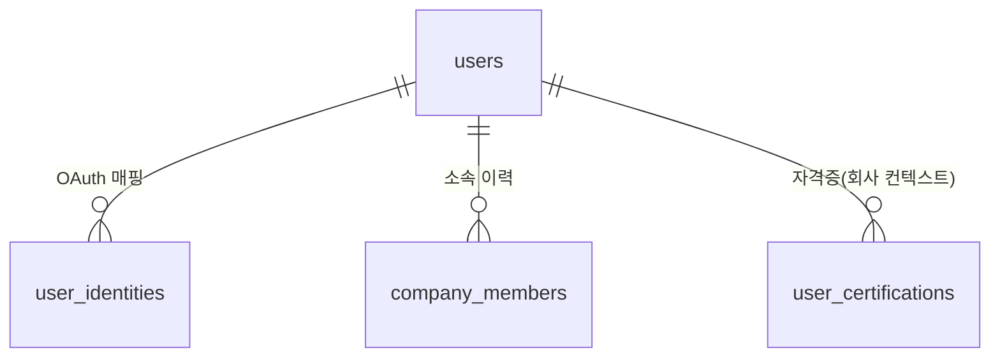
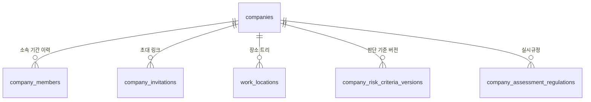
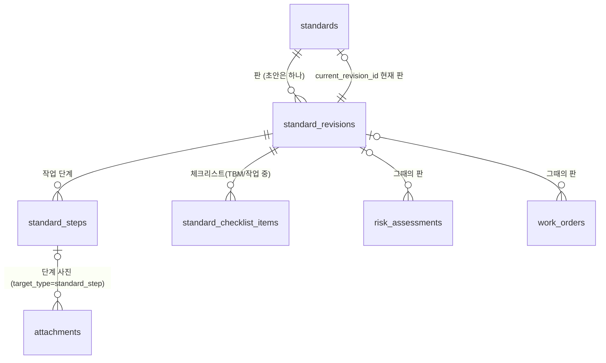
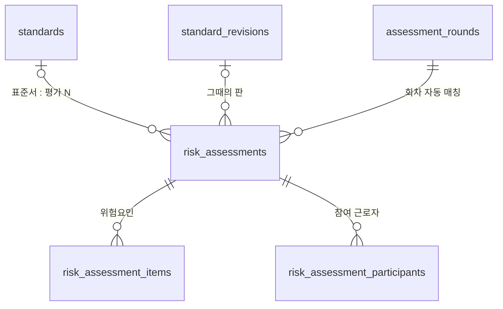
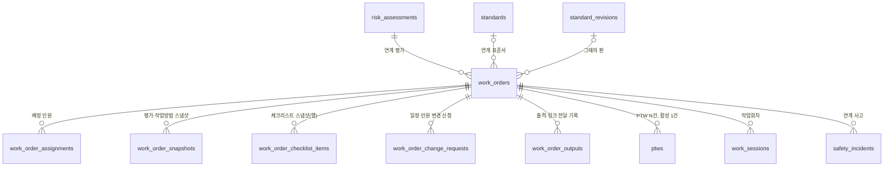
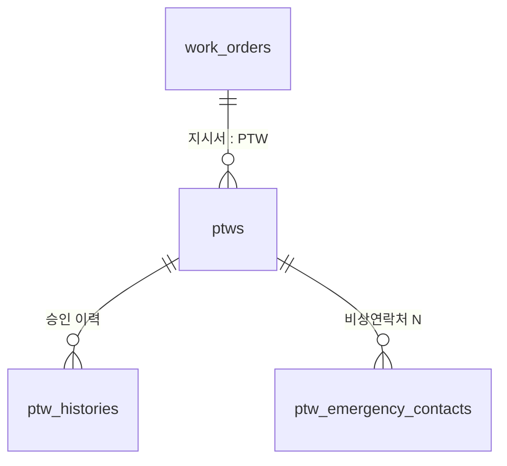
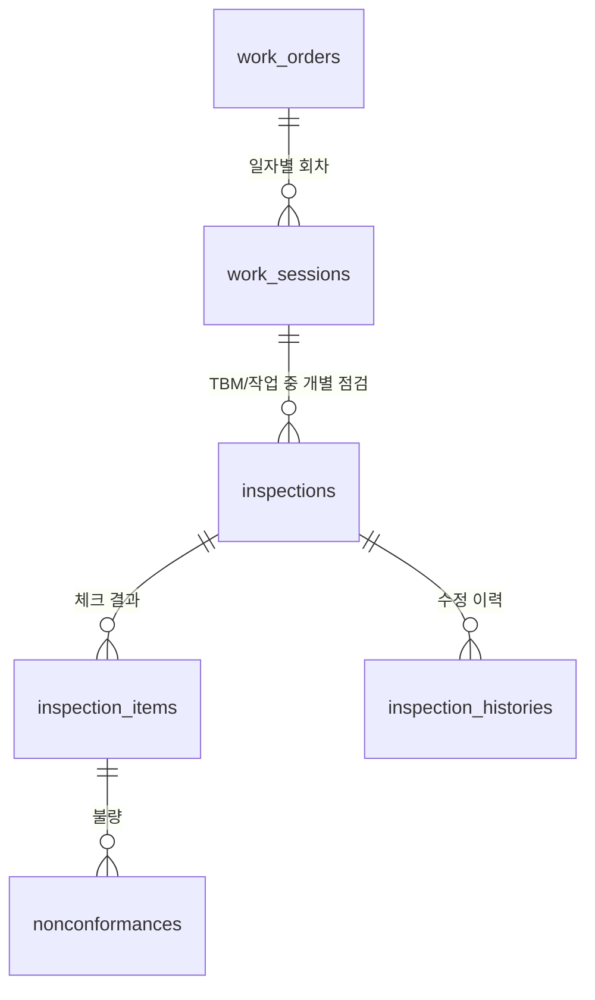
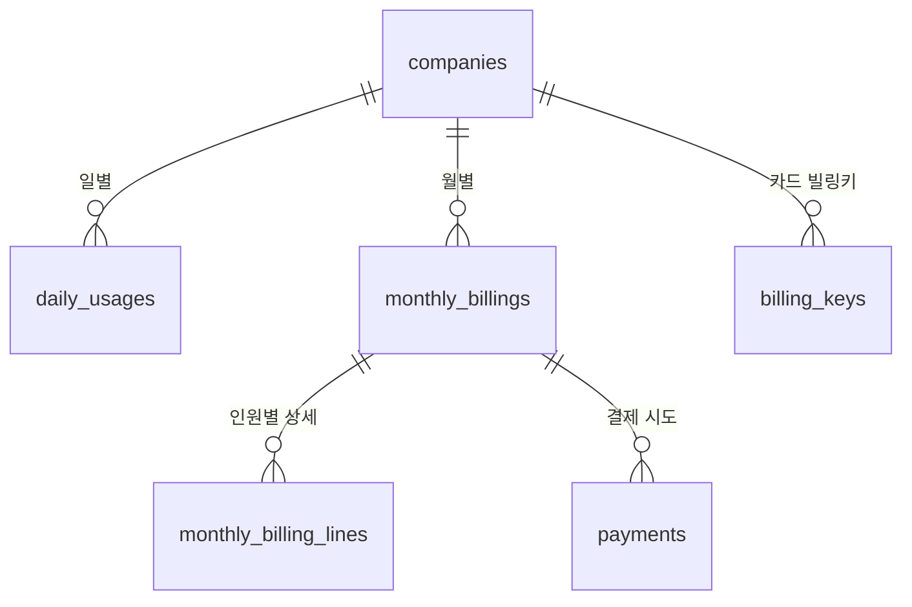

# SMBE 데이터베이스 스키마 설계 v5.5

- 작성일: 2026-09-18 (v5.5 개정)

**v5.6 변경 요약 (2026-09-24, 표준서 개정본 — `db/0023`)**
1. 표준서를 **마스터 + 판(개정본)** 으로 확정. 구현 테이블명은 `standards` / `standard_revisions` / `standard_steps` / `standard_checklist_items` (v5.5 의 `work_standards`/`work_standard_versions` 자리). 5장 전체 교체
2. 판 상태는 `DRAFT` / `APPROVED` / `SUPERSEDED` 셋. 승인 대기·반려 없음. 초안은 표준서당 하나(부분 유니크)
3. `risk_assessments.standard_revision_id`, `work_orders.standard_revision_id` — 그때의 판. 지시서 `STANDARD_META` 사본에도 `standard_revision_no`
4. `attachments.storage_key` UNIQUE 해제 — 개정 시 같은 파일을 새 단계가 가리킨다. 삭제는 마지막 참조일 때만 S3 오브젝트 제거

**v5.5 변경 요약**
1. `users.email` NULL 허용 (카카오 이메일 미동의·이메일 없는 작업자 대응)
2. 지시서 체크리스트 스냅샷 테이블 `work_order_checklist_items` 신설, 점검 결과가 이를 참조
3. `companies.business_start_date` 추가 (최초 위험성평가 1개월 기한 판정)
4. `work_sessions` 상태 저장 → **조회 시 계산**으로 변경 (상태 전환 배치 제거)
5. 위험성평가 보존 3년 기준 명시
6. Pro 전환 후에는 인원이 줄어도 **관리감독자가 수동으로 무료 전환하기 전까지 Pro 유지**
7. 청구 라인은 소속 일수가 아니라 **과금 대상 일수(billable_days)** 기준
8. 감사로그에 개인정보 원문 저장 금지 (참조 ID만)
9. 안전점수 관심도 항목은 하드코딩, 별도 테이블 없음
10. 중복 방지 인덱스·판단기준 헤더 테이블 등 보완
- 기준 문서: `docs/SMBE-design-v5.4.md`, `docs/SMBE-menu-layout-v5.4.md`
- 대상 DB: **PostgreSQL** (Neon, `docs/architecture.md`)
- 목적: v5.4 설계·화면 정의를 반영한 관계형 스키마를 도메인별로 도식화하고, 컬럼·상태·관계를 정의한다. DDL·마이그레이션은 별도.

---

## 0. 설계 원칙

1. **명명**: 소문자 snake_case, 테이블 복수형(`users`, `work_orders`). 상태 코드는 대문자 스크리밍(`ISSUED`).
2. **키**: PK는 `id uuid` (`gen_random_uuid()`), 대량 이벤트는 `bigserial`. FK는 `<table_singular>_id`.
3. **시각**: `timestamptz`. 날짜만 있는 값은 `date`.
4. **테넌트**: 대부분 테이블에 `company_id` 컬럼을 두어 회사 단위 조회·격리를 단순화한다. 감사로그·운영자 로그는 예외.
5. **물리 삭제 없음** (설계 13장): 인원 소속·지시서·평가·점검 등은 상태 컬럼(`RESIGNED`, `CANCELED`, `DISCARDED`, `SUPERSEDED`) 또는 `*_at` 종료 시각으로 종료 처리. 개인정보 파기는 지정 컬럼 NULL화.
6. **스냅샷**: 지시서 발급·PTW 승인·회의·사고 등은 원본 참조 대신 `jsonb` 스냅샷을 동반해 원본 변경에 영향받지 않는다.
7. **상태 enum**: PostgreSQL `CREATE TYPE ... AS ENUM`을 사용. enum 추가는 `ALTER TYPE ADD VALUE`로 관리.
8. **감사**: 모든 write에 `audit_logs` 기록. `path`(`WEB`/`QR`/`LINK`/`BATCH`)와 `is_self_approval`을 남긴다.
9. **첨부**: 실제 바이트는 S3, DB엔 `attachments` 메타만. 사진 열람 여부는 Pro 정책으로 화면 단에서 판정.
10. **미확정 도메인은 스키마도 유보**: v5.4 17장(안전점수 산식, 결제 세부, 회사 탈퇴 실행 권한 등)에 걸린 컬럼은 존재만 남기고 값 규칙은 코드에서 결정.

---

### 0-1. 필요 확장

- `pgcrypto` 또는 `pg_uuidv7` — `gen_random_uuid()` (PG13+는 내장)
- `citext` — 이메일 대소문자 무시 비교

---

## 1. 도메인 지도

```mermaid
flowchart LR
  subgraph 계정
    U[users]
    UI[user_identities]
    OP[operators]
  end
  subgraph 회사·인원
    C[companies]
    CM[company_members]
    CI[company_invitations]
    UC[user_certifications]
  end
  subgraph 회사설정
    L[work_locations]
    RC[company_risk_criteria_versions]
    AR_REG[company_assessment_regulations]
  end
  subgraph 표준서
    WS[standards]
    WSV[standard_revisions]
  end
  subgraph 평가
    RA[risk_assessments]
    AR[assessment_rounds]
  end
  subgraph 지시서·PTW
    WO[work_orders]
    P[ptws]
  end
  subgraph 현장
    WSN[work_sessions]
    INS[inspections]
    NC[nonconformances]
    INC[safety_incidents]
  end
  subgraph 회의
    WM[weekly_meetings]
  end
  subgraph 요금
    DU[daily_usages]
    MB[monthly_billings]
    PAY[payments]
  end
  subgraph 부가
    AL[audit_logs]
    NOTIF[notifications]
    ATT[attachments]
  end

  U --> CM --> C
  U --> UI
  C --> L
  C --> RC
  C --> AR_REG
  C --> WS --> WSV
  WSV --> RA
  WSV --> WO
  RA --> WO
  RA --> AR
  WO --> P
  WO --> WSN --> INS --> NC
  WO --> INC
  C --> WM
  C --> DU --> MB --> PAY
  C --> AL
  U --> NOTIF
  C --> ATT
  OP -.운영조정.-> C
```

---

## 2. 계정 · 소셜 로그인

### 2-1. ER



### 2-2. `users`

| 컬럼 | 타입 | 비고 |
|---|---|---|
| id | uuid PK | |
| display_name | text | 표시명 |
| email | citext UNIQUE NULL | **로그인 계정의 메일**. 소셜 로그인에서 따라온 값이라 사람이 고치지 않는다. **NULL 허용** — 카카오 이메일 미동의, 이메일 없는 작업자 대응 |
| contact_email | citext NULL | **알림 받을 주소** (`0018`). 가입 화면·마이페이지에서 직접 정한다. 비어 있으면 `email` 로 보낸다 (`COALESCE(contact_email, email)`). 유일 제약 없음 — 현장 한 곳이 대표 메일을 같이 쓸 수 있다 |
| phone | text NULL | 유료 문자·알림톡 발송용, 무료는 이메일. 가입 화면에서 선택으로 받는다 |
| status | enum(`ACTIVE`,`WITHDRAWN`) | 계정 자체 상태 |
| created_at, updated_at | timestamptz | |

- 휴대폰 인증은 두지 않음(설계 4장). `phone`은 알림·초대 수신 정보로만 사용.
- 이메일이 없으면 알림은 인앱으로만 수신. 이메일 필요한 기능(승인 링크 수신 등)은 이메일 등록 유도.
- 같은 이메일로 서로 다른 provider 가입 시 계정 병합 처리 규칙은 확인사항.
- **받는 주소와 신원을 나눈다.** 로그인은 `user_identities` 로 하므로 `contact_email`
  을 바꿔도 로그인에 영향이 없다. 메일을 보내는 자리는 모두 `COALESCE(contact_email,
  email)` 을 쓴다 (지시서 링크·가입 신청 알림·주간 회의 알림).
- 계정 탈퇴 시 개인정보(`email`, `contact_email`, `phone`, `display_name`) 파기. 소속 기록의 이름 스냅샷은 별도 유지.

### 2-3. `user_identities` (OAuth)

| 컬럼 | 타입 | 비고 |
|---|---|---|
| id | uuid PK | |
| user_id | uuid FK users | |
| provider | enum(`NAVER`,`GOOGLE`,`KAKAO`) | 설계 4장 확정 |
| provider_user_id | text | |
| created_at | timestamptz | |
| UNIQUE(provider, provider_user_id) | | |

### 2-4. `user_certifications` (자격증 참고정보)

| 컬럼 | 타입 | 비고 |
|---|---|---|
| id | uuid PK | |
| user_id | uuid FK | |
| company_id | uuid FK | 자격증은 회사 컨텍스트에서 관리 |
| name | text | 자격증 이름 |
| attachment_id | uuid FK attachments | 첨부파일 |
| created_at | timestamptz | |

- 미등록을 이유로 작업 배정을 막지 않음(레이아웃 C-01).

---

## 3. 회사 · 소속 이력

### 3-1. ER



### 3-2. `companies`

| 컬럼 | 타입 | 비고 |
|---|---|---|
| id | uuid PK | |
| name | text | 회사명 |
| business_type | text | 업종(템플릿 매칭 키) |
| business_start_date | date | 사업개시일. 최초 위험성평가 1개월 기한 판정 근거 |
| company_code | text UNIQUE | 직접 가입 코드, 변경 불가 |
| initial_employee_size_band | enum(`UNDER_5`,`FROM_5_TO_19`,`FROM_20_TO_49`,`FROM_50`) | 회사 생성 시 입력 (v5.4) |
| current_employee_size_band | enum(위와 동일) NULL | 활성 인원 기반 자동 갱신 |
| active_headcount | int | 캐시 값. 진짜 판정은 뷰/쿼리로 재계산 |
| free_limit | int DEFAULT 10 | 운영자 백오피스에서 조정 가능 |
| pro_state | enum(`FREE`,`PRO_VOLUNTARY`,`PRO_MANDATORY`) | 한도 초과 자동 전환은 `PRO_MANDATORY` |
| pro_started_at | timestamptz NULL | 과금 시작일 근거 |
| pro_downgraded_at | timestamptz NULL | 관리감독자가 수동으로 무료 전환한 시각 |
| pro_downgraded_by | uuid FK users NULL | |
| created_by | uuid FK users | 관리감독자 권한 부여 |
| created_at, updated_at | timestamptz | |
| withdrawn_at | timestamptz NULL | 회사 탈퇴 시각 |

- `initial_employee_size_band`, `current_employee_size_band`, `active_headcount`를 화면에서 구분 표시(레이아웃 A-01).
- `pro_state` 변경 이력은 `audit_logs`에 남긴다.
- **Pro 유지 규칙(v5.5)**: 한도 초과로 Pro 전환된 뒤에는 인원이 한도 이하로 줄어도 Pro를 유지한다. **관리감독자가 설정에서 수동으로 무료 전환**해야 FREE로 돌아간다. 따라서 `daily_usages.is_pro`는 그날 인원이 아니라 그 시점의 `pro_state`를 따른다.

### 3-3. `company_members` (소속 기간 이력)

| 컬럼 | 타입 | 비고 |
|---|---|---|
| id | uuid PK | |
| user_id | uuid FK users | |
| company_id | uuid FK companies | |
| role | enum(`MANAGER_SUPERVISOR`,`MANAGER_SAFETY`,`WORKER`) | 역할 변경은 행 갱신, 이력은 audit_logs |
| status | enum(`JOIN_PENDING`,`ACTIVE`,`RESIGNED`) | v5.4 14-1 대응 |
| joined_via | enum(`INVITE_LINK`,`DIRECT_JOIN`,`COMPANY_CREATE`) | 승인 여부 판단 |
| joined_at | timestamptz | 일할 청구 근거 |
| left_at | timestamptz NULL | NULL이면 현재 소속 |
| approved_by | uuid NULL | 직접 가입 승인자 |
| approved_at | timestamptz NULL | |
| snapshot_display_name | text | 퇴사 후 이름 스냅샷(원본 users는 개인정보 파기 대상) |

- 인덱스: `(company_id, left_at)`, `(user_id, left_at)`. **1인 1회사 = `left_at IS NULL`인 행 최대 1개** (partial unique index 권장).
- 역할 변경 규칙(설계 4장)은 앱 로직에서 강제.

### 3-4. `company_invitations`

| 컬럼 | 타입 | 비고 |
|---|---|---|
| id | uuid PK | |
| company_id | uuid FK | |
| inviter_id | uuid FK users | |
| contact_email | citext NULL | |
| contact_phone | text NULL | 전화번호 초대 시 링크 전달 방법은 확인사항(17장) |
| target_role | enum(`MANAGER_SUPERVISOR`,`MANAGER_SAFETY`,`WORKER`) | |
| token | text UNIQUE | |
| sent_at | timestamptz | |
| expires_at | timestamptz NULL | |
| accepted_at | timestamptz NULL | 승인 없이 바로 소속 |
| accepted_by | uuid FK users NULL | |

---

## 4. 회사 설정 (장소 · 판단기준 · 실시규정)

### 4-1. `work_locations` (장소 트리, 최대 5단계)

| 컬럼 | 타입 | 비고 |
|---|---|---|
| id | uuid PK | |
| company_id | uuid FK | |
| parent_id | uuid FK work_locations NULL | 루트는 NULL |
| name | text | |
| depth | smallint CHECK (depth BETWEEN 1 AND 5) | 5단계 제한(설계 4장) |
| path_cache | text | 표시용 캐시("사업장 > 동 > 층") |
| sort_no | int | |
| disabled_at | timestamptz NULL | 삭제 대신 비활성 |

- 중간 단계 선택 허용(설계 4장). 지시서·PTW·사고 화면에서 depth 무관하게 선택.

### 4-2. `company_risk_criteria_versions` (판단 기준 버전 헤더) — v5.5

| 컬럼 | 타입 | 비고 |
|---|---|---|
| id | uuid PK | 평가·참여자 테이블이 이 ID를 FK로 참조 |
| company_id | uuid FK | |
| version | int | 변경 시 증가 |
| is_current | bool | 현재 적용 버전만 true |
| decided_at | timestamptz | |
| UNIQUE(company_id, version) | | |

### 4-3. `company_risk_criteria_levels` (수준별 정의)

- 기본값 상/중/하 + 허용 가능 수준(설계 5-2). 회사가 문구·허용 수준을 변경 가능.

| 컬럼 | 타입 | 비고 |
|---|---|---|
| id | uuid PK | |
| criteria_version_id | uuid FK company_risk_criteria_versions | |
| level_code | enum(`HIGH`,`MID`,`LOW`) | |
| description | text | 각 수준 설명 |
| allowable | bool | 허용 가능 여부 |
| UNIQUE(criteria_version_id, level_code) | | |

### 4-4. `company_risk_criteria_participants` (기준 결정·변경 참여 근로자)

| 컬럼 | 타입 | 비고 |
|---|---|---|
| id | uuid PK | |
| criteria_version_id | uuid FK company_risk_criteria_versions | 정수 참조 대신 FK로 변경(v5.5) |
| user_id | uuid FK users | |
| snapshot_display_name | text | 개인정보 파기 대비 |

### 4-5. `company_assessment_regulations` (위험성평가 실시규정)

| 컬럼 | 타입 | 비고 |
|---|---|---|
| id | uuid PK | |
| company_id | uuid FK | |
| version | int | |
| purpose_and_method | text | 목적·방법 |
| roles_responsibilities | text | 담당자 역할·책임 |
| timing | text | 실시 시기 |
| is_current | bool | |
| updated_by, updated_at | | |
| UNIQUE(company_id, version) | | |

---

## 5. 작업표준서

v5.6: 판(개정본) 구조. 확정된 판은 고치지 않고, 개정은 현재 판을 복사한 초안을 고쳐 확정한다(화면 용어 "확정" = 상태값 `APPROVED`) (설계 5-1·14-2). 마이그레이션 `db/0006`(단일 문서화) → `db/0023`(판 구조).

### 5-1. ER



### 5-2. `standards` (마스터)

| 컬럼 | 타입 | 비고 |
|---|---|---|
| id | uuid PK | |
| company_id | uuid FK | |
| name | text | 현재 판의 거울 (확정 시 갱신) |
| ptw_required | bool | 현재 판의 거울 |
| status | text(`DRAFT`,`APPROVED`,`ARCHIVED`) | 생성 즉시 `APPROVED`. `DRAFT` 는 예약값 |
| current_revision_id | uuid FK standard_revisions NULL | 확정된 현재 판 |
| archived_at, archived_by | | 폐기. 작성 중인 초안이 있으면 거부 (먼저 버리거나 확정) |
| created_by, created_at, updated_at | | |

### 5-3. `standard_revisions` (판)

| 컬럼 | 타입 | 비고 |
|---|---|---|
| id | uuid PK | 지시서·평가는 이 id 를 참조 |
| standard_id | uuid FK standards | ON DELETE CASCADE |
| revision_no | int ≥ 1 | 1, 2, … 표시는 "n판" |
| status | text(`DRAFT`,`APPROVED`,`SUPERSEDED`) | 설계 14-2 |
| name, ptw_required | | 그 판의 내용 |
| change_note | text ≤ 1000 NULL | 개정 사유. 확정할 때 적는다 |
| created_by, created_at, updated_at | | |
| approved_by, approved_at | | |
| UNIQUE(standard_id, revision_no) | | |
| UNIQUE(standard_id) WHERE status = 'DRAFT' | | 초안은 하나 |

- **개정 시작**: 현재 판의 name·ptw_required·단계·체크리스트·단계 사진 참조를 복사한 `DRAFT` 를 만든다 (revision_no = max + 1).
- **확정**: 초안 → `APPROVED`, 이전 `APPROVED` → `SUPERSEDED`, `standards.current_revision_id`·name·ptw_required 갱신. 그 뒤 그 판은 불변 (단계·체크리스트·사진 모두).
- **버리기**: 초안 행 삭제(단계·체크리스트 CASCADE). 초안 단계의 사진 행은 `DELETED` 표시하고, 다른 판이 쓰지 않는 파일만 S3 에서 지운다. **폐기**는 초안이 있으면 거부한다.
- 승인 대기(`PENDING`)·반려(`REJECTED`)는 두지 않는다 (관리자가 곧바로 확정).

### 5-4. `standard_steps` (작업방법 단계)

| 컬럼 | 타입 | 비고 |
|---|---|---|
| id | uuid PK | 단계 사진이 이 id 에 붙는다 |
| standard_id | uuid FK standards | 판과 같은 표준서 (조회 편의) |
| revision_id | uuid FK standard_revisions | ON DELETE CASCADE |
| order_no | int | |
| step_text | text | |
| UNIQUE(revision_id, order_no) | | |

- 초안 저장은 단계 **id 를 보존**한다 — 사진이 id 에 붙어 있다. 초안에서 사라진 단계의 사진은 `DELETED` 로 표시한다.
- 사진 업로드·삭제는 **초안(`DRAFT`) 판의 단계에만** 허용 (`attachments.ts`). 읽기는 어느 판이든 된다.

### 5-5. `standard_checklist_items` (체크리스트)

| 컬럼 | 타입 | 비고 |
|---|---|---|
| id | uuid PK | |
| standard_id | uuid FK standards | |
| revision_id | uuid FK standard_revisions | ON DELETE CASCADE |
| category | text(`TBM`,`DURING_WORK`) | 설계 5-1 필수 구분 |
| order_no | int | |
| text | text | 체크 항목 |
| UNIQUE(revision_id, category, order_no) | | |

- 초안 저장은 체크리스트를 통째로 갈아 끼운다 (사진 대상이 아니다). `origin` 컬럼은 미구현.

### 5-6. `industry_templates` (업종별 공통 템플릿) — 미구현

| 컬럼 | 타입 | 비고 |
|---|---|---|
| id | uuid PK | |
| industry_code | text | |
| kind | enum(`WORK_STANDARD`,`SIMPLE_ASSESSMENT`,`CHECKLIST_TBM`,`CHECKLIST_DURING_WORK`) | |
| payload | jsonb | 구조는 후속 확정. 콘텐츠 자체는 파일 관리도 가능 |
| version | int | |
| is_current | bool | |

---

## 6. 위험성평가

### 6-1. ER



### 6-2. `risk_assessments` (일반+간이 공용)

| 컬럼 | 타입 | 비고 |
|---|---|---|
| id | uuid PK | |
| company_id | uuid FK | |
| standard_id | uuid FK standards NULL | 간이평가는 NULL |
| standard_revision_id | uuid FK standard_revisions NULL | 그때의 판 (v5.6). 회차 추가는 현재 판, 지시서에서 평가를 요청할 때는 초안이 복사해 둔 판 |
| is_simple | bool | 간이평가 여부 (표준서 없는 작업) |
| name | text | 평가명/작업명 |
| assessment_kind | enum(`FIRST`,`PERIODIC`,`AD_HOC`,`CONTINUOUS`) | 최초/정기/수시/상시 |
| performed_on | date | 실시일자 |
| status | enum(`DRAFT`,`PENDING`,`APPROVED`,`REJECTED`) | |
| criteria_version_id | uuid FK company_risk_criteria_versions | 적용한 회사 판단 기준 버전 |
| work_method_snapshot | text | 표준서 연동 or 직접입력 스냅샷 |
| safety_info | jsonb | 4호 사전조사(설비 사양, MSDS, 주변 환경, 재해 이력) |
| assessment_round_id | uuid FK assessment_rounds NULL | 회차 자동 매칭 |
| submitted_at, approved_at, approved_by | | |
| rejection_reason | | |
| created_by, created_at, updated_at | | |
| retention_until | date | **법정 3년 보존** 만료일 (산안법 시행규칙 제37조) |

- 간이평가도 같은 데이터 구조를 사용(설계 6장). 필수 기록(위험요인·수준·감소대책·참여 근로자·안전보건정보)은 저장.
- 감소대책 조치 이행 정보는 `risk_assessment_items`의 `actual_*` 컬럼으로 관리.

### 6-3. `risk_assessment_items` (위험요인·대책·조치)

| 컬럼 | 타입 | 비고 |
|---|---|---|
| id | uuid PK | |
| assessment_id | uuid FK | |
| order_no | int | |
| hazard | text | 유해·위험요인 |
| initial_risk_level | enum(`HIGH`,`MID`,`LOW`) | |
| initial_allowable | bool | 위험성 허용 여부. 서버가 `initial_risk_level` + `criteria_snapshot` 에서 계산해 넣는다(`ACCEPTABLE` 만 참). 화면 입력이 아니다 (v5.6) |
| reduction_measure | text | 감소대책 |
| responsible_user_id | uuid FK users NULL | 조치 담당자 |
| planned_completion_date | date NULL | |
| actual_action | text NULL | 실제 조치 내용 |
| actual_completion_date | date NULL | 완료일 |
| post_risk_level | enum(`HIGH`,`MID`,`LOW`) NULL | 조치 후 수준 |
| post_allowable | bool NULL | 서버가 `post_risk_level` + `criteria_snapshot` 에서 계산(`NOT_ACCEPTABLE` 만 거짓). 거짓이면 `follow_up_measure` 필수 |

### 6-4. `risk_assessment_participants` (참여 근로자)

| 컬럼 | 타입 | 비고 |
|---|---|---|
| id | uuid PK | |
| assessment_id | uuid FK | |
| user_id | uuid FK users | |
| snapshot_display_name | text | 이후 개인정보 파기 대비 |

### 6-5. `assessment_rounds` (사업장 평가 회차)

| 컬럼 | 타입 | 비고 |
|---|---|---|
| id | uuid PK | |
| company_id | uuid FK | |
| name | text | 예: 2026년 정기평가 |
| assessment_kind | enum(같음) | |
| start_date, end_date | date | 자동 수집 기간 |
| approved_at, approved_by | | 회차 단위 승인 |
| report_generated_at | timestamptz NULL | Pro 보고서 |

- 매칭: `risk_assessments.performed_on ∈ [start_date, end_date]` AND `assessment_kind` 일치. 중첩 처리 규칙은 확인사항(레이아웃 17장).

---

## 7. 작업지시서

### 7-1. ER



### 7-2. `work_orders`

| 컬럼 | 타입 | 비고 |
|---|---|---|
| id | uuid PK | |
| company_id | uuid FK | |
| name | text | 작업명 |
| group_label | text NULL | 조 추가 시 조 이름(주간/야간 등). 원 설계상 조별 지시서 분리 |
| standard_id | uuid FK standards NULL | 표준서 기반이면 |
| standard_revision_id | uuid FK standard_revisions NULL | 초안 저장 때부터 기록 (v5.6). 화면에서 표준서를 고를 때 복사한 판(`draft_data.standardRevisionId`)이 그 표준서의 확정된 판이면 그것, 아니면 그때의 현재 판. 발급 사본·지시서에서 요청한 평가도 이 판을 쓴다 |
| risk_assessment_id | uuid FK risk_assessments | 승인된 평가만 사용 |
| work_period_start, work_period_end | date | |
| work_start_time, work_end_time | time | 1일 작업시간 상한 16시간(앱 검증) |
| location_id | uuid FK work_locations NULL | |
| location_free_text | text NULL | 직접입력은 마스터 등록하지 않음 |
| ptw_required | bool | true로 올린 뒤 false로 낮출 수 없음(앱 규칙) |
| status | enum(`DRAFT`,`ISSUE_PENDING`,`ISSUED`,`IN_PROGRESS`,`COMPLETED`,`CANCELED`) | v5.4 14-3 |
| issue_version | int DEFAULT 0 | 출력물의 발행 버전 |
| issued_at | timestamptz | 최초 발급 시각 |
| self_approval_at_issue | bool | 신청&승인으로 발급된 건 |
| cancel_reason | text NULL | 취소 사유 필수 |
| canceled_at, canceled_by | | |
| created_by, created_at, updated_at | | |

- **복사 규칙(설계 8장)**: 복사본 원본 지시서 ID는 저장하지 않는다(v1.6 확정). 새 지시서로 복제.

### 7-3. `work_order_assignments`

| 컬럼 | 타입 | 비고 |
|---|---|---|
| id | uuid PK | |
| work_order_id | uuid FK | |
| user_id | uuid FK users | |
| status | enum(`ACTIVE`,`PENDING_APPROVAL`,`UNASSIGNED`) | 인원 추가 승인 대기 중에도 `PENDING_APPROVAL`로 작업·점검 가능(설계 7장) |
| assigned_at | timestamptz | |
| unassigned_at | timestamptz NULL | |
| approved_at, approved_by | | 인원 추가 승인 시 |

- `UNIQUE(work_order_id, user_id) WHERE status <> 'UNASSIGNED'` — 중복 배정 방지(v5.5)

### 7-4. `work_order_snapshots` (발급 시 스냅샷)

| 컬럼 | 타입 | 비고 |
|---|---|---|
| id | uuid PK | |
| work_order_id | uuid FK | |
| snapshot_kind | enum(`RISK_ASSESSMENT`,`WORK_METHOD`,`STANDARD_META`) | 체크리스트는 `work_order_checklist_items`로 분리(v5.5) |
| payload | jsonb | 그 시점 원본 복사 |
| taken_at | timestamptz | |

- 지시서 상세는 항상 스냅샷을 우선 표시(설계 7장 · 레이아웃 W-03).
- `STANDARD_META` payload: `standard_id`, `standard_name`, `ptw_required`, `standard_updated_at`, `standard_revision_id`, `standard_revision_no`, `captured_at`. 상세는 "표준서명 (n판)" 으로 보인다 (v5.6).
- 체크리스트는 jsonb가 아니라 아래 `work_order_checklist_items`로 행 복사한다(점검 결과가 FK로 참조해야 하므로).

### 7-5. `work_order_checklist_items` (지시서 체크리스트 스냅샷) — v5.5 신설

발급 시점의 체크리스트를 **행으로 복사**한다. 점검 결과는 이 테이블을 참조한다.

| 컬럼 | 타입 | 비고 |
|---|---|---|
| id | uuid PK | |
| work_order_id | uuid FK work_orders | |
| category | enum(`TBM`,`DURING_WORK`) | |
| order_no | int | |
| text | text | 발급 시점 항목 원문 |
| origin | enum(`TEMPLATE`,`STANDARD`,`FIELD_ADDED`,`SIMPLE_ASSESSMENT`) | 표준서 유래 항목은 삭제 불가 판정 |
| source_checklist_item_id | uuid FK standard_checklist_items NULL | 추적용. 현장 추가·간이평가 항목은 NULL (미구현 — 지시서는 판 id 로 표준서 원문에 닿는다) |
| added_at | timestamptz | 발급 후 추가된 항목 구분 |

- 도입 이유
  - 현장 추가 항목·간이평가 기반 지시서는 표준서 원본 행이 없어 FK를 걸 수 없음
  - 표준서 개정 시 항목 ID가 바뀌므로, 원본 참조만으로는 진행 중 지시서의 점검 대상이 흔들림
  - 회차 완료 판정("배정 작업자 전원이 모든 항목 체크")의 기준 목록이 DB에 존재해야 함
- 표준서 개정 내용은 **다음 지시서부터** 반영된다(기존 지시서 불변).

### 7-6. `work_order_change_requests` (일정·인원 변경 신청)

| 컬럼 | 타입 | 비고 |
|---|---|---|
| id | uuid PK | |
| work_order_id | uuid FK | |
| change_kind | enum(`SCHEDULE`,`ADD_PERSONNEL`,`REMOVE_PERSONNEL`) | |
| before_json, after_json | jsonb | |
| requested_by, requested_at | | |
| status | enum(`PENDING`,`APPROVED`,`REJECTED`,`AUTO_APPLIED`) | 승인 불필요는 즉시 AUTO_APPLIED |
| approved_by, approved_at, rejected_at, rejection_reason | | |
| approval_skip_reason | enum(`NO_PTW`,`SELF_APPROVER`,`REMOVE_ONLY`) NULL | 승인 생략 근거 |
| is_self_approval | bool | |

### 7-7. `work_order_outputs` (QR·링크 발송 기록)

| 컬럼 | 타입 | 비고 |
|---|---|---|
| id | uuid PK | |
| work_order_id | uuid FK | |
| issue_version | int | 출력물에 표기되는 발행 버전 |
| printed_at | timestamptz NULL | |
| link_channel | enum(`EMAIL`,`SMS`) | SMS는 Pro 회사 대상 |
| link_target | text | 이메일/전화번호 |
| sent_at, delivered_at | | |
| status | enum(`SENT`,`FAILED`,`RETRY_PENDING`) | |
| failure_reason | text NULL | |

---

## 8. PTW (위험작업허가)

### 8-1. ER



### 8-2. `ptws`

| 컬럼 | 타입 | 비고 |
|---|---|---|
| id | uuid PK | |
| work_order_id | uuid FK work_orders | |
| sequence_no | int | 발급 후 추가 신청 시 증가. 활성 1건 유지 위해 partial unique index |
| status | enum(`PENDING`,`APPROVED`,`REJECTED`,`WITHDRAWN`,`EXPIRED`,`VOID`) | v5.4 14-4 |
| applicant_id | uuid FK users | 지시서 작성자 |
| approver_id | uuid FK users | 지정 승인자 (재직 관리자만) |
| is_self_approval | bool | 신청&승인 |
| validity_start, validity_end | timestamptz | 지시서 작업기간과 연동 |
| location_id | uuid FK work_locations | 마스터 선택 |
| equipment | text | 대상 설비 |
| work_content_snapshot | text | 표준서에서 연동 |
| responsible_manager_id | uuid FK users | 작업책임자 |
| special_notes | text NULL | |
| hot_work | bool | 화기작업 여부 |
| fire_watch_user_id | uuid FK users NULL | 화재감시자 |
| approved_at, rejected_at, withdrawn_at, expired_at | | |
| rejection_reason | text NULL | 반려 시 필수 |
| created_at, updated_at | | |

- **활성 1건 제약**: `CREATE UNIQUE INDEX ... ON ptws (work_order_id) WHERE status IN ('PENDING','APPROVED')`.
- 발급 후 추가 PTW가 승인 전이어도 작업·점검을 막지 않음(설계 14-7). 화면 표시만.

### 8-3. `ptw_histories`

| 컬럼 | 타입 | 비고 |
|---|---|---|
| id | uuid PK | |
| ptw_id | uuid FK | |
| action | enum(`APPLY`,`APPROVE`,`REJECT`,`WITHDRAW`,`REAPPLY`,`CHANGE_APPROVER`,`SELF_APPROVE`,`EXPIRE`,`VOID`) | |
| actor_id | uuid FK users NULL | |
| detail | jsonb | 반려 사유·변경 사항 |
| at | timestamptz | |

### 8-4. `ptw_emergency_contacts` (비상연락처 다건)

| 컬럼 | 타입 | 비고 |
|---|---|---|
| id | uuid PK | |
| ptw_id | uuid FK | |
| name | text | |
| phone | text | |
| order_no | int | |

---

## 9. 안전점검 (작업회차 · TBM · 작업 중 · 불량)

### 9-1. ER



### 9-2. `work_sessions` (지시서 × 작업일자)

| 컬럼 | 타입 | 비고 |
|---|---|---|
| id | uuid PK | |
| work_order_id | uuid FK | |
| work_date | date | 시작일 기준(자정 넘는 야간작업도 시작일로 묶음) |
| starts_at | timestamptz | 표시용. 게이트에는 쓰지 않는다 |
| ends_at | timestamptz | 표시용 |
| excluded_at | timestamptz NULL | 일정 변경으로 제외된 회차 |
| excluded_reason | text NULL | |
| UNIQUE(work_order_id, work_date) | | 조 추가는 지시서 자체가 분리되므로 (work_order, date) 유일 |

- **상태는 저장하지 않고 조회 시 계산한다(v5.5).** 상태 전환 배치 없음.
- **판정 기준은 작업일자(KST) 하나.** 시간대별 판정 창은 두지 않는다 — 도입기 사용자가 시간대를 놓쳐도 TBM을 이어서 찍을 수 있어야 정착한다.

| 계산 상태 | 조건 | 입력 |
|---|---|---|
| FUTURE | `work_date > today(KST)` | 잠금 |
| TODAY | `work_date = today(KST)` | 가능 |
| PAST | `work_date < today(KST)` | 가능 (지난 회차 사후 입력) |
| EXCLUDED | `excluded_at IS NOT NULL` | 잠금 · 누락 판정 대상에서 제외 |

- 완료 여부(`done`)는 상태와 별도. 배정 작업자 전원 TBM 확인 + 작업 중 점검 1건 이상이면 참.
- 지연 입력 여부는 `inspections.submitted_at`과 `work_sessions.ends_at`을 비교해 조회 시 계산한다(별도 컬럼 없음).
- 알림(누락 메일 등)은 계산 결과를 매일 훑어서 발송하는 **알림 배치**만 유지

### 9-3. `inspections` (개별 점검)

| 컬럼 | 타입 | 비고 |
|---|---|---|
| id | uuid PK | |
| work_session_id | uuid FK | |
| work_order_id | uuid FK | 조회 편의 |
| inspector_id | uuid FK users | |
| inspector_role | enum(`WORKER`,`MANAGER_SUPERVISOR`,`MANAGER_SAFETY`) | 역할별 구분 조회 |
| kind | enum(`TBM`,`DURING_WORK`) | |
| input_path | enum(`QR`,`LINK`,`WEB`) | 사후입력은 `WEB` |
| inspected_at | timestamptz | |
| is_post_input | bool | 사후 입력 여부 |
| post_input_by | uuid NULL | |
| post_input_at | timestamptz NULL | |
| comment | text NULL | |

- **TBM 완료 기준**: 배정 작업자 전원 1건씩. 미확인자는 계산으로 산출해 화면 표시.
- **작업 중 점검 완료 기준**: 회차당 1건 이상.
- `UNIQUE(work_session_id, inspector_id, kind) WHERE is_post_input = false` — 같은 회차에 같은 사람이 같은 종류를 중복 등록하지 않도록(v5.5). 순회점검을 여러 번 허용하려면 `kind='DURING_WORK'`은 제외.

### 9-4. `inspection_items`

| 컬럼 | 타입 | 비고 |
|---|---|---|
| id | uuid PK | |
| inspection_id | uuid FK | |
| work_order_checklist_item_id | uuid FK work_order_checklist_items | 지시서 스냅샷 항목 참조(v5.5) |
| checklist_text_snapshot | text | 당시 항목 이름 |
| result | enum(`PASS`,`FAIL`,`NA`) | |
| comment | text NULL | |

### 9-5. `inspection_item_photos` (Pro)

| 컬럼 | 타입 | 비고 |
|---|---|---|
| id | uuid PK | |
| inspection_item_id | uuid FK | |
| attachment_id | uuid FK attachments | |

### 9-6. `inspection_histories` (수정 이력)

| 컬럼 | 타입 | 비고 |
|---|---|---|
| id | uuid PK | |
| inspection_id | uuid FK | |
| action | enum(`CREATE`,`UPDATE`,`POST_INPUT`) | |
| before_json, after_json | jsonb | |
| actor_id | uuid FK users | |
| at | timestamptz | |

### 9-7. `nonconformances` (불량)

| 컬럼 | 타입 | 비고 |
|---|---|---|
| id | uuid PK | |
| company_id | uuid FK | 테넌트 조회용 |
| work_order_id | uuid FK | |
| inspection_item_id | uuid FK | |
| work_session_id | uuid FK work_sessions | 다음 회차 TBM 팝업 대상 판정(v5.5) |
| description_snapshot | text | 불량 원문 |
| assigned_manager_id | uuid FK users | 알림·조치 담당자 |
| status | enum(`OPEN`,`RESOLVED`) | 지시서 COMPLETED와 무관하게 유지 |
| occurred_at | timestamptz | |
| resolution_content | text NULL | 조치 내용 필수 |
| resolved_at, resolved_by | | |

- 조치 내용은 다음 회차 TBM 시작 시 팝업으로 노출(설계 10장). 조회는 `work_order_id` 기준.

---

## 10. 안전사고

### 10-1. `safety_incidents`

| 컬럼 | 타입 | 비고 |
|---|---|---|
| id | uuid PK | |
| company_id | uuid FK | |
| work_order_id | uuid FK NULL | 지시서 연계 사고면 지정 |
| snapshot_from_work_order | jsonb NULL | 지시서에서 스냅샷 복사 |
| incident_date | date | |
| incident_time | time | |
| location_id | uuid FK work_locations NULL | 직접입력 허용은 확인사항 |
| location_detail | text | |
| content | text | 사고내용 |
| prevention_plan | text | 재발방지대책 |
| registered_by, registered_at | | |

- 지시서 수정·취소 후에도 사고 기록은 유지(설계 11장).

### 10-2. `safety_incident_photos` (Pro)

| 컬럼 | 타입 | 비고 |
|---|---|---|
| id | uuid PK | |
| incident_id | uuid FK | |
| attachment_id | uuid FK | |

---

## 11. 주간 안전점검 회의

### 11-1. `weekly_meetings`

| 컬럼 | 타입 | 비고 |
|---|---|---|
| id | uuid PK | |
| company_id | uuid FK | |
| iso_year | int | |
| iso_week | int | |
| week_start, week_end | date | |
| status | enum(`PENDING`,`COMPLETED`,`MISSED`) | 미실시 주 표시 |
| discussion | text NULL | |
| completed_at, completed_by | | |
| UNIQUE(company_id, iso_year, iso_week) | | |

### 11-2. `weekly_meeting_attendees`

| 컬럼 | 타입 | 비고 |
|---|---|---|
| id | uuid PK | |
| meeting_id | uuid FK | |
| user_id | uuid FK users | |

### 11-3. `weekly_meeting_items` (자동 수집)

| 컬럼 | 타입 | 비고 |
|---|---|---|
| id | uuid PK | |
| meeting_id | uuid FK | |
| item_kind | enum(`NONCONFORMANCE`,`SAFETY_INCIDENT`,`ASSESSMENT_MEASURE_MISSING`,`NEAR_MISS`) | 아차사고는 기능 도입 후 연결 |
| source_id | uuid | 불량/사고/평가아이템 ID |
| status_at_meeting | text | 당시 상태 스냅샷 |
| review_note | text NULL | 비고 |
| action_confirmed | bool DEFAULT false | 이행 확인 |

- 회의 체크만으로 원본 불량·평가 대책을 자동 종결하지 않음(레이아웃 I-03).

---

## 12. 요금 · 과금 · 결제

### 12-1. ER



### 12-2. `daily_usages`

| 컬럼 | 타입 | 비고 |
|---|---|---|
| id | uuid PK | |
| company_id | uuid FK | |
| usage_date | date | 매일 새벽 전날 계산 |
| headcount | int | 그날과 겹치는 활성 인원(퇴사자 제외, DISTINCT user) |
| free_limit | int | 그날 시점의 회사 무료 한도 |
| is_pro | bool | 그 시점 `companies.pro_state <> 'FREE'` 기준. 한도 초과로 전환된 뒤에는 인원이 줄어도 유지 |
| pro_mode | enum(`NONE`,`VOLUNTARY`,`MANDATORY`) | |
| billable_count | int | is_pro면 headcount, 아니면 0 |
| is_billable_day | bool | billable_count > 0 인 날 (청구 라인 계산 기준) |
| unit_price_monthly | numeric(12,2) | 10,000 (설계 1장) |
| unit_price_daily | numeric(12,4) | 월 요금 ÷ 그 달 일수 |
| amount | numeric(12,2) | billable_count × unit_price_daily |
| calculated_at | timestamptz | |
| UNIQUE(company_id, usage_date) | | |

### 12-3. `monthly_billings`

| 컬럼 | 타입 | 비고 |
|---|---|---|
| id | uuid PK | |
| company_id | uuid FK | |
| year_month | text | 'YYYY-MM' |
| subtotal | numeric(12,2) | daily 합산(원 단위 절사) |
| vat | numeric(12,2) NULL | 부가세 표기 정책 미정 |
| total | numeric(12,2) | |
| status | enum(`DRAFT`,`FINALIZED`) | 월 마감 시 청구 스냅샷 확정 |
| finalized_at | timestamptz NULL | |
| UNIQUE(company_id, year_month) | | |

### 12-4. `monthly_billing_lines` (인원별 스냅샷)

| 컬럼 | 타입 | 비고 |
|---|---|---|
| id | uuid PK | |
| billing_id | uuid FK | |
| user_id | uuid FK users | |
| member_id | uuid FK company_members | |
| billable_days | int | **과금 대상 일수** — 소속 겹친 일 중 `daily_usages.is_billable_day = true`인 날만 (v5.5) |
| overlapping_days | int | 참고용: 그 달과 소속 겹친 전체 일수 |
| unit_price_daily | numeric(12,4) | |
| amount | numeric(12,2) | billable_days × unit_price_daily |
| snapshot_display_name | text | |

- 라인 합계 = `monthly_billings.subtotal`이 되도록 **billable_days 기준으로만 계산**한다. 무료 구간(한도 이하였던 날)은 라인 금액에 포함하지 않는다.

### 12-5. `payments`

| 컬럼 | 타입 | 비고 |
|---|---|---|
| id | uuid PK | |
| company_id | uuid FK | |
| billing_id | uuid FK NULL | 월 단위 결제 |
| method | enum(`BILLING_KEY`,`WIRE_TRANSFER_ANNUAL`) | 계좌이체는 연간 선납 |
| amount | numeric(12,2) | |
| status | enum(`PENDING`,`SUCCESS`,`FAILED`,`RETRY_SCHEDULED`,`FALLBACK_TO_FREE`) | 재시도 후 실패 시 무료 강등 |
| attempted_at, succeeded_at, failed_at | | |
| external_txn_id | text NULL | PG 참조 |
| tax_invoice_no | text NULL | 세금계산서 자동 발행 번호 |
| retry_count | int DEFAULT 0 | |
| failure_reason | text NULL | |

### 12-6. `billing_keys`

| 컬럼 | 타입 | 비고 |
|---|---|---|
| id | uuid PK | |
| company_id | uuid FK | |
| provider | text | PG사 미정 |
| key_ciphertext | bytea | 암호화 저장 |
| card_masked | text | UI 표기용 |
| registered_at | timestamptz | |
| revoked_at | timestamptz NULL | |

---

## 13. 감사로그 · 알림 · 첨부

### 13-1. `audit_logs` (전역 감사)

| 컬럼 | 타입 | 비고 |
|---|---|---|
| id | bigserial PK | 순차 조회 최적화 |
| company_id | uuid FK NULL | 회사 범위 로그 |
| actor_id | uuid FK users NULL | 시스템·배치는 NULL |
| action | text | `CREATE`/`UPDATE`/`DELETE`/`APPROVE`/`REJECT`/`ISSUE`/`CANCEL`/`SELF_APPROVE`/... |
| target_type | text | 테이블/도메인 이름 |
| target_id | uuid NULL | |
| path | enum(`WEB`,`QR`,`LINK`,`API`,`BATCH`) | |
| before_json, after_json | jsonb | |
| is_self_approval | bool DEFAULT false | 자가 승인 태그 |
| at | timestamptz | |

- 인덱스: `(company_id, at DESC)`, `(target_type, target_id, at DESC)`.
- 읽기 전용. 삭제 API 없음.
- **개인정보 저장 금지(v5.5)**: `before_json` / `after_json`에 이름 · 이메일 · 전화번호 원문을 넣지 않고 **참조 ID만 저장**한다. 화면에서는 조회 시점에 조인해 표시하고, 파기된 사용자는 "탈퇴한 사용자"로 표시.
  - 이유: 감사로그는 삭제 불가인데 개인정보는 파기 대상이라 원문을 담으면 두 규칙이 충돌
  - 불가피하게 값 비교가 필요한 필드는 마스킹 저장(`010-****-1234`)
- 유료 제한 문서 내용의 로그 노출 범위는 확인사항(레이아웃 17장).

### 13-2. `notifications`

| 컬럼 | 타입 | 비고 |
|---|---|---|
| id | uuid PK | |
| user_id | uuid FK | |
| company_id | uuid FK NULL | |
| kind | text | `PTW_APPROVAL`, `INVITATION`, `NONCONFORMANCE_ASSIGN`, `WEEKLY_MEETING_MISSED`, `BILLING_FAILED`, ... |
| target_type, target_id | | |
| subject, body | text | |
| channel | enum(`EMAIL`,`SMS`,`IN_APP`) | SMS는 Pro 회사만 |
| sent_at, delivered_at, failed_at | | |
| read_at | timestamptz NULL | |

### 13-3. `attachments`

| 컬럼 | 타입 | 비고 |
|---|---|---|
| id | uuid PK | |
| company_id | uuid FK | |
| uploaded_by | uuid FK users | |
| kind | enum(`STANDARD_PHOTO`,`INSPECTION_PHOTO`,`INCIDENT_PHOTO`,`CERTIFICATION`,`ASSESSMENT_ATTACH`,`ASSESSMENT_INFO`) | |
| storage_key | text | S3 오브젝트 키. v5.6: UNIQUE 해제 — 표준서 개정 시 같은 파일을 새 단계가 가리키는 행이 더 생긴다. 삭제는 마지막 참조일 때만 오브젝트를 지운다 |
| mime_type | text | |
| byte_size | bigint | |
| uploaded_at | timestamptz | |
| deleted_at | timestamptz NULL | 실제 파일은 S3 lifecycle |

- 사진(`*_PHOTO`)은 Pro 회사 정책. 자격증·평가 첨부는 무료도 허용 여지 있음(확인사항).

---

## 14. 안전점수

- v5.4에서 산식·배점·기준선은 미확정. 스키마는 근거 수집·스냅샷 저장에 한정.
- **관심도 항목(안전방침·담당자 교육 등)은 당분간 하드코딩**한다. 별도 테이블을 만들지 않으며, 추후 개선 과제로 둔다(v5.5).

### 14-1. `safety_score_snapshots`

| 컬럼 | 타입 | 비고 |
|---|---|---|
| id | uuid PK | |
| company_id | uuid FK | |
| snapshot_at | timestamptz | |
| total_score | numeric(5,2) NULL | 미확정 산식이므로 NULL 허용 |
| breakdown | jsonb | 4개 대분류 소계 |
| formula_version | text | 산식 버전 태깅 |

### 14-2. `safety_score_signals` (계산 신호)

| 컬럼 | 타입 | 비고 |
|---|---|---|
| id | bigserial PK | |
| company_id | uuid FK | |
| signal_code | text | `MANAGER_ASSIGNED`,`TBM_CONFIRMED`,`ASSESSMENT_APPROVED`,`NONCONFORMANCE_RESOLVED`,`INCIDENT_REGISTERED`,`PTW_APPROVED`, ... |
| occurred_at | timestamptz | |
| source_type, source_id | | 이벤트 원본 링크 |
| weight | numeric | 산식 결정 후 반영 |

---

## 15. 공개 콘텐츠 · 진단 이벤트

- 공개 가이드·진단 콘텐츠는 파일 기반 운영 가능(설계 1장). 개인 응답은 서버에 저장하지 않으며 브라우저 세션에 임시 보관.
- 전환·전환율 측정만 익명 이벤트로 저장.

### 15-1. `guide_page_events` (조회 이벤트)

| 컬럼 | 타입 | 비고 |
|---|---|---|
| id | bigserial PK | |
| slug | text | 가이드 문서 URL 슬러그 |
| session_hash | text | 개인 식별 아님 |
| occurred_at | timestamptz | |
| referrer | text NULL | |

### 15-2. `recognition_check_events` (진단 진행)

| 컬럼 | 타입 | 비고 |
|---|---|---|
| id | bigserial PK | |
| session_hash | text | |
| stage | enum(`START`,`STEP1_DONE`,`STEP2_DONE`,`RESULT_VIEW`,`GOTO_SIGNUP`) | |
| industry_code | text NULL | 답변 원문·PII는 저장하지 않음 |
| size_band | text NULL | |
| occurred_at | timestamptz | |

---

## 16. 운영자 백오피스

### 16-1. `operators`

| 컬럼 | 타입 | 비고 |
|---|---|---|
| id | uuid PK | |
| email | citext UNIQUE | |
| display_name | text | |
| role | enum(`SMBE_ADMIN`) | 초기 단일 역할 |
| created_at, updated_at | | |

### 16-2. `operator_actions` (운영자 감사)

| 컬럼 | 타입 | 비고 |
|---|---|---|
| id | bigserial PK | |
| operator_id | uuid FK operators | |
| company_id | uuid FK companies NULL | |
| action | text | 예: `SET_FREE_LIMIT`, `SET_DISCOUNT`, `VIEW_BILLING` |
| detail | jsonb | before/after |
| at | timestamptz | |

### 16-3. `company_data_exports` (탈퇴 전 전체 다운로드)

| 컬럼 | 타입 | 비고 |
|---|---|---|
| id | uuid PK | |
| company_id | uuid FK | |
| requested_by | uuid FK users | |
| requested_at | timestamptz | |
| completed_at | timestamptz NULL | |
| download_key | text NULL | S3 pre-signed |
| expires_at | timestamptz NULL | |

- 회사 탈퇴 실행 권한과 보관·삭제 세부 정책은 확인사항(레이아웃 17장).

---

## 17. 크로스 도메인 관계 요약

- **소속 판정**: 지시서·점검·사고 등은 작성 시점 `company_id`를 함께 저장. 재입사·타 회사 이동 시 과거 기록의 회사 매핑이 흔들리지 않음.
- **사용자 개인정보 파기**: `users`의 email/phone/display_name은 파기 대상. 각 도메인 참조 테이블은 `snapshot_display_name` 컬럼으로 이름을 스냅샷 보존.
- **문서 스냅샷**: 지시서·PTW·평가·사고는 스냅샷을 우선 표시. 원본 개정·삭제는 스냅샷에 영향 없음. 지시서·평가는 표준서의 **판 id** 도 적어 두어, 사본 밖의 원문(단계·사진)도 그 판으로 다시 읽는다 (v5.6).
- **일할 청구**: `company_members.joined_at/left_at`을 기준으로 `daily_usages`를 매일 재계산, 월 마감 시 `monthly_billings`·`monthly_billing_lines`로 스냅샷 확정.
- **감사 로그**: 모든 상태 전이·승인·자가승인·발급·취소·수정·삭제는 `audit_logs`에 기록. UI의 자가 승인 태그는 `is_self_approval` 근거.

---

## 18. 확인사항이 걸린 컬럼 · 결정 대기 스키마

레이아웃 17장 및 설계 15장 미정 항목을 스키마 관점에서 매핑한다.

| v5.4 확인사항 | 관련 테이블·컬럼 | 결정 후 처리 |
|---|---|---|
| 평가 승인 방식(관리자 직접 승인 등) | `risk_assessments.approver_id`, 상태 전이 규칙 | 앱 규칙 확정 |
| 평가/회의/사고 상세 권한 | 도메인 서비스 계층 | RLS 도입 여부 결정 |
| 무료 모바일 안전점수 노출 위치 | 저장은 동일, 노출은 화면 | 화면 규칙 |
| 무료 과거 불량 조회 범위 | `nonconformances` 조회 필터 | 리소스 정책 |
| 감사 로그의 유료 제한 문서 노출 | `audit_logs.before/after_json` 필터 | 조회 API 규칙 |
| 초대 전달(무료 전화번호) | `company_invitations.contact_phone`, 발송 채널 | 알림 채널 정책 |
| 평가 회차 중첩 처리 | `assessment_rounds` + `risk_assessments.assessment_round_id` | 매칭 우선순위 규칙 |
| PTW 여러 날 승인 기한 판정 | `ptws.validity_start` vs 승인 마감일 | 앱 규칙 |
| PTW 최초 허가 정보 필수값 | `ptws.equipment/work_content_snapshot/...` NULL 허용 여부 | 유효성 규칙 |
| 사고 장소 직접입력 | `safety_incidents.location_id` NULL + 대체 컬럼 필요 여부 | 컬럼 추가 여부 |
| 첨부파일 티어 세부 | `attachments.kind` 별 노출 정책 | 티어 규칙 |
| 안전점수 산식·게이지 | `safety_score_snapshots.total_score`, `safety_score_signals.weight` | 산식 확정 후 반영 |
| 회사 탈퇴 실행 권한/보관 | `companies.withdrawn_at`, `company_data_exports` | 정책 확정 |
| 부가세·재시도·증빙 | `monthly_billings.vat`, `payments.retry_count`, tax invoice 처리 | 결제 정책 확정 |
| 불량 조치 기한/독촉 | `nonconformances`에 기한 컬럼 미도입 | 정책 결정 후 컬럼 추가 |
| 동일 이메일 다중 provider 계정 병합 | `users.email`, `user_identities` | 병합 규칙 확정 |
| 안전점수 관심도 근거 | 하드코딩(v5.5), 테이블 없음 | 추후 개선 |

---

## 19. 다음 단계 제안

1. 마이그레이션 도구 선정(Prisma/Kysely/Drizzle 중 하나, 또는 raw SQL) — `docs/architecture.md`의 "마이그레이션 도구와 최초 업무 스키마" 결정 사항.
2. **1페이즈 스키마**: `users`/`user_identities`/`companies`/`company_members`/`work_locations`. 로그인·회사 생성·인원 초대까지 커버.
3. **2페이즈**: `standards`+revisions, `risk_assessments`+items, `work_orders`+assignments/snapshots/checklist_items, `ptws`.
4. **3페이즈**: `work_sessions`/`inspections`/`nonconformances`, `safety_incidents`, `weekly_meetings`, 감사·알림·첨부.
5. **4페이즈**: 과금 파이프라인(`daily_usages` → `monthly_billings` → `payments`), 운영자 백오피스.
6. 안전점수는 산식 확정 전까지 시그널 수집만 활성화. 관심도 항목은 하드코딩. UI는 준비 중 안내 유지.
7. 회차 상태는 뷰 또는 서비스 계층 계산 함수로 구현하고, 배치는 **알림 발송용**만 둔다.
